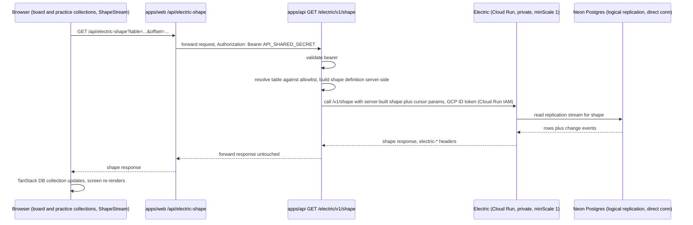

# Architecture: Local-first sync

> **NOT IN PRODUCTION.** This code is merged on `main` and runs locally and in the e2e stack, but
> the sync path is dead in production: `apps/api`'s Cloud Run service has no `ELECTRIC_SERVICE_URL`,
> so every shape request would fail there. The Electric Cloud Run service itself exists in the prod
> project but has never started — no `electricDatabaseUrl` was ever configured on the Pulumi prod
> stack. Production still serves every one of these screens from the SSR/fetch fallback path.
> **Do not enable it in production before the shape allowlist described below is in place** — see
> `.planning/local-first-electric-sync/todo.md`.

## What changes structurally

**Reads for the subjects/curricula board and the practice screens move from request/response fetch
to a synced local-first read path.** Instead of a loader fetching a snapshot from `apps/api` on
every navigation, the browser holds live TanStack DB collections backed by Electric shapes; updates
stream in over HTTP long-polling instead of requiring a refetch. Electric is an overlay, never a
precondition: each converted screen still gets its first paint from server-rendered/fetched data
and reconciles the live rows on top (see
`docs/architecture/batch-practice-electric-fallback/review.md`). Writes everywhere in the app, and
every unconverted route, stay on the existing fetch-through-`apps/api` path unchanged.

**`apps/api` stays the single gatekeeper the browser and any future client talk to — it never
talks to Electric directly from the browser.** A `GET /electric/v1/shape` route on `apps/api`
authenticates the existing `API_SHARED_SECRET` bearer (the same check every other `apps/api`
route already uses), then calls Electric's own `/v1/shape` endpoint and hands Electric's
`electric-*` response headers back untouched. `API_SHARED_SECRET` must never reach the browser
(existing invariant in `api-client.ts`), so something server-side has to hold it — and making that
something `apps/api` (rather than a one-off) means this is the exact contract a future mobile
client reuses as-is, the same way it already reuses every other `apps/api` route.

**The gatekeeper is an authorization layer, not a pass-through: the shape definition is built
server-side from a fixed allowlist.** The client may name a table, but only by picking one the
gatekeeper already allows; the gatekeeper then constructs the outgoing shape definition itself —
which table, which columns, any base filter — and forwards only the sync-protocol cursor params
(the offset/handle/live/cursor set Electric needs to resume a stream) from the incoming request.
Anything else a client sends is not carried through.

This is a security requirement, not a style preference. Electric's own auth guidance is explicit
that the shape definition parameters "must be set server-side" because "letting clients specify the
table allows access to any table", and that "your proxy is an authorization layer that controls the
shape definition (table, queryable columns, main WHERE)" — https://electric.ax/docs/guides/auth.
Since this app's Electric instance runs with `ELECTRIC_INSECURE=true` and has no auth of its own,
a gatekeeper that forwarded the client's query string verbatim would let anyone who can reach
`apps/web`'s same-origin forwarding route stream any table in the database, including tables that
have nothing to do with the board or practice screens. The allowlist is the only thing standing
between a page visitor and the whole schema.

**`apps/web` only adds a thin same-origin forwarding route, `GET /api/electric-shape`.** The
browser's `ShapeStream` client points at this same-origin path (avoiding CORS and keeping the
secret off the wire to the browser); the route does nothing but forward to `apps/api`'s
gatekeeper with the shared secret attached server-side.

**Electric runs as its own private Cloud Run service, kept warm, talking to Neon directly.**
Self-hosted (not Electric Cloud) on Cloud Run, but configured differently from this app's other
three services in two ways:
- `minScale: 1` instead of `minScale: 0` — Electric holds a persistent Postgres logical
  replication connection; scale-to-zero would drop that connection on every idle period and pay
  a cold-start replication-resync cost on every wake, which defeats the point of a live sync
  service. The other three services are fine at zero because they're stateless per-request.
- **Private** (no `allUsers` invoker), authorized via Cloud Run IAM rather than app-level auth —
  Electric has no auth of its own to check a bearer token against, so the only place to enforce
  "only `apps/api` may call this" is the platform's own invoker policy. Only `apps/api`'s service
  account gets `roles/run.invoker` on it; `apps/api` calls it with a minted GCP ID token per
  request.

Electric reads Postgres via logical replication, which requires a **direct (non-pooled)**
connection string to Neon — the pooled connection this app's other services use does not support
replication slots.

**No per-user scoping in the shape query.** The app is single-user today (same precedent as
`user_streaks`), so the gatekeeper enforces which *tables* may be synced, not which rows belong to
which tenant. A future mobile client is just a second client for the same one user, not a new
tenant, so row-level scoping isn't deferred complexity — it's a non-issue for this app's actual
shape. Table-level scoping is not optional in the same way, because without it the proxy exposes
the whole schema rather than just this user's own data.

**TanStack DB is beta software as of this writing.** Accepted as a known risk for a personal
project at this scope.

## Flow

## New infrastructure

One new Cloud Run service (Electric), private, `minScale: 1` — the only one of this app's four
Cloud Run services that isn't scale-to-zero. One new `apps/api` module (`electric/`) with no new
database table of its own; it's a proxy plus its allowlist. `apps/api`'s service account gets
`run.invoker` on the Electric service. Neon's connection string used for replication must be the
direct (non-pooled) one, configured separately from the pooled string the rest of the app uses.

The prod deploy workflow reads the Electric service URL back off Cloud Run and sets it as
`apps/api`'s `ELECTRIC_SERVICE_URL`, but only when the `PROD_ELECTRIC_ENABLED` repository variable
is `true` — the same dormancy switch pattern `deploy-web` already uses. That switch is the
deliberate production kill switch for this whole read path: with it off, `apps/api` has no Electric
URL and every shape request fails closed, which is the current production state.
`ELECTRIC_AUTH_MODE` is never set in production; the API's env schema defaults it to `iam`
(Cloud Run service-to-service ID tokens), and only local dev overrides it to `none`.

## Scope boundary

What actually syncs through Electric today, and what does not:

- **Converted — the subjects/curricula board** (`apps/web/src/curriculum/board.collection.ts`):
  the `subjects`, `curricula` and `sources` tables. `sources` is requested with a narrowed column
  projection (`id`, `curriculum_id`, `kind`) because the board only needs source *kinds* to derive
  each curriculum's origin client-side; since column projection is part of the shape definition, the
  gatekeeper's allowlist is what has to encode that narrowing.
- **Converted — the practice screens** (`apps/web/src/practice/practice.collection.ts`): the
  `phrases`, `attempts` and `language_practice_settings` tables, feeding the batch-practice loop on
  `/practice/:subjectId`.
- **Six tables total** are therefore in use across both screens. That set is the ceiling the
  gatekeeper's allowlist has to cover, and nothing outside it should be reachable.
- **Unconverted, on purpose:** every other route (dashboard, curriculum tree, stats, probe/quiz
  sessions, chat), and all writes anywhere in the app — including create/delete subject on the
  board and phrase-batch generation on the practice screens — all keep using the existing
  fetch-through-`apps/api` path.
- **Not built:** optimistic-write wiring through TanStack DB (deferred to whichever future slice
  tackles a write-heavy route), Electric Cloud (self-host was chosen instead), and the mobile
  client itself (only the reusable `apps/api` contract exists).
- **Not deployed:** the Cloud Run/IAM changes are live — `pulumi up` has run in CI, the
  `post-anki-electric` service and its IAM binding exist in the prod project — but the service has
  never successfully started because the Neon direct-connection string was never set as the
  `electricDatabaseUrl` Pulumi secret, and `apps/api` has no `ELECTRIC_SERVICE_URL`. Production
  runs entirely on the fetch fallback. See `.planning/local-first-electric-sync/todo.md` for the
  remaining steps and the order they must happen in.

Whether to convert further routes follows from how these two behave in production, not from a
predetermined rollout plan.
