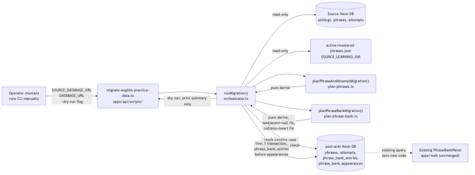

# Architecture Review: migrate-english-practice-data

## What was reviewed

A one-time, human-run CLI script (`apps/api/scripts/migrate-english-practice-data.ts`) that imports
the retired `english-advanced` app's practice history — its Neon `settings`/`phrases`/`attempts`
tables plus two local JSON phrase-bank files — into post-anki's existing English-subject schema
(`phrases`, `attempts`, `phrase_bank_entries`, `phrase_bank_appearances`,
`language_practice_settings`). No schema changes, no new frontend code, no new infrastructure.

## Documentation found

`docs/architecture/phrase-bank-mastery.md` already documented this exact gap as an explicit,
named scope exclusion ("migrating the source app's real practice history" was called out as
deliberately deferred). This build closes that gap and updates that same document's "Scope
boundary" section to point at the new script — a real instance of keeping documentation current
rather than letting it drift, not just a new file added in isolation.

## As-built architecture

The CLI (`scripts/migrate-english-practice-data.ts`) is a thin entry point: validates required env
vars by name (`SOURCE_DATABASE_URL`, `DATABASE_URL`), opens both connections, calls
`runMigration()`, prints a summary, closes both connections in a `finally` block. All real logic
lives in `apps/api/src/migrate-english-practice-data/`, split along a read → plan (pure derive) →
write sequence:

- Two source readers (`readSourceSettings`/`readSourcePhrases`/`readSourceAttempts` for the
  Neon side, `readSourcePhraseBankJson` for the JSON files) — always read in full, dry-run or
  live, so the printed dry-run summary is a true preview of what a live run would do.
- Two pure planning modules (`plan-phrases.ts`, `plan-phrase-bank.ts`) compute exactly what rows
  need creating, checking existing-row ids first for idempotency, with zero DB writes themselves.
- The write path is a single Drizzle transaction (`db.transaction`) wrapping every insert plus the
  subject-kind flip and settings upsert — a crash mid-write rolls back to the exact pre-run state,
  and `phrase_bank_entries` is inserted before `phrase_bank_appearances` to satisfy the one real
  insert-order dependency.

The source-database access pattern is worth calling out specifically: this project has a
`no-raw-sql-outside-db-layer` dependency-cruiser rule restricting the `pg` package to
`apps/api/src/db/`. The source Neon database isn't part of this app's own Drizzle schema, so the
repo layer here depends on a minimal structural interface (`SourceQueryPool` — just a `query()`
method shape) instead of importing `pg` directly. A real `pg.Pool` satisfies it with no cast
needed. This is a clean way to stay inside an existing architectural boundary rather than carving
out a one-off exception for it.

## Verdict

**Sound.** The read/plan/write separation is real (the plan functions are genuinely pure — no DB
calls inside them, confirmed by reading them), idempotency is checked by existing-id lookup before
every insert category, and the live write path is atomic. This is exactly the shape a one-time
migration script should have: safe to dry-run repeatedly, safe to re-run live without duplicating
data, and it fails loudly (missing subject, missing settings row) rather than silently proceeding
on a misconfigured target.

Two minor, non-blocking observations — not architectural problems, just worth knowing about:

1. `scripts/migrate-english-practice-data.ts:12` hardcodes
   `DEFAULT_SOURCE_LEARNING_DIR = "/Users/ikushlianski/webdata/ilya-projects/english-advanced/learning"`
   — an absolute path specific to this one machine. Fine for a script one person runs once from
   their own laptop (which is exactly this script's situation), but it means the default silently
   breaks if run from anywhere else. `SOURCE_LEARNING_DIR` is overridable via env var, so this is a
   convenience default, not a hard dependency — just flagging it as the kind of thing that looks
   like a bug to a future reader who doesn't know the context.
2. The whole live write is one transaction across four tables plus a subject update. That's the
   right call for atomicity at this data volume (a personal practice history, not a bulk dataset),
   but it does mean a very large future import (not this one) could hold a single long transaction.
   Irrelevant at today's scale — noted only because the pattern would need reconsidering if this
   script were ever reused for a much bigger dataset.

## Questions a reviewer would ask

1. What happens if the operator runs `--dry-run` once, then runs live, but the source database has
   changed in between (someone's still actively using the source app)? The script re-reads
   everything fresh on the live run, so this is actually safe — but it's worth the operator knowing
   the dry-run summary isn't a locked snapshot.
2. `flipSubjectKindToLanguagePractice` unconditionally sets the subject's `kind` to
   `language-practice` inside the same transaction as the data writes — is there a scenario where a
   partial prior state (subject already flipped, but an earlier interrupted run left no rows) would
   make this a no-op that masks incomplete data from a previous crash? Worth a quick manual check
   before the first live run, given this is exactly the kind of state a crash mid-transaction should
   prevent — but confirming the transaction boundary really does cover this is cheap insurance.
3. `upsertLanguagePracticeSettings` overwrites any existing settings row's `level`/`pack` with the
   source's values (Decision 9, explicitly documented) — if the user had already started using the
   English subject in post-anki before running this import and manually set a different level, this
   migration silently overwrites that choice. Is that the intended precedence, or should an existing
   non-default settings row win?
4. Why does `nextSequenceBase`/`matchExistingEntryId` get reused directly from
   `practice/phrase-bank.repo.ts` rather than reimplemented — and does that create any coupling risk
   if that file's behavior changes later for reasons unrelated to migration (e.g. a future
   phrase-bank feature changes how sequence numbers are allocated)?
5. The dry-run mode still requires both live connections (documented explicitly, SCENARIO 5/6) — was
   a fully offline dry-run mode (against a cached snapshot) considered and rejected, or just not
   needed for a one-person, one-time script?
6. Is there a plan for what happens to the `english-advanced` repo/worktree after this runs
   successfully once? The wishlist item's own "Done when" mentions the source repo "can be safely
   archived" — does anything in this build or its `todo.md` actually track that follow-up, or is it
   left entirely to the operator's memory?
