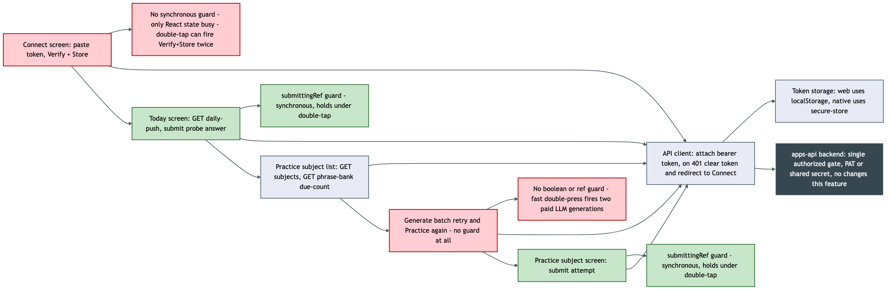

# Architecture Review: mobile-study-loop (+ double-submit follow-up fix)

## What was reviewed

Three commits on `main`: the `mobile-study-loop` merge (subject picker + phrase-practice screen
for language-practice subjects on the Expo mobile app, plus a real `expo-secure-store` web crash
fix), the follow-up `Fix mobile double-submit protection` commit, and the log entry marking both
done. In scope: `apps/mobile/app/index.tsx`, `apps/mobile/app/practice/index.tsx`,
`apps/mobile/app/practice/[subjectId].tsx`, `apps/mobile/src/practice/*`,
`apps/mobile/src/subject/subject-list.api.ts`, `apps/mobile/src/api/token-storage.ts`, and their
interaction with the unchanged `apps/mobile/src/api/client.ts` and `apps/mobile/app/connect.tsx`.
No backend changes are part of this feature.

## Documentation found

`docs/architecture/mobile-study-review-app.md` already existed and was updated in place by this
feature (the "Two entry points" and "Web-platform token storage fallback" sections) rather than
duplicated elsewhere — consistent with what the plan's own "Documentation changes" section
promised. `.planning/mobile-study-loop/spec.md` (state: confirmed) is a full spec with an
explicit Definition of Done and nine autonomously-resolved decisions; `.planning/LOG.md`'s entry
documents the merge, the independent re-verification pass, and the double-submit bug it found.
Both were read and cross-checked against the actual diff — no drift found between what the docs
claim and what the code does.

## As-built architecture

Two independent entry points feed the same backend through one shared API client. **Connect**
takes a pasted personal access token, calls `verifyToken()` (a probe `GET /daily-push` request)
and, on success, `setStoredToken()`, then navigates to Today. **Today** (pre-existing,
unmodified in shape) calls `GET /daily-push` and submits via `submitProbeAnswer`. **Practice**
is new: a subject-list screen fans out `GET /subjects` + `GET .../phrase-bank` (bounded
`Promise.all`) for a due-count per language-practice subject, then a per-subject screen that
generates a phrase batch (`POST .../phrase-batches`) and submits one answer at a time
(`POST .../attempts`). All four screens funnel through `apiFetch` (`client.ts`), which attaches
the bearer token and, on a 401, clears the stored token and redirects back to Connect — the same
failure path for every screen, not reimplemented per screen. `token-storage.ts` branches on
`Platform.OS`: web reads/writes `window.localStorage`, native calls `expo-secure-store`
unchanged. The backend receives no changes — the same global `authorized()` gate that already
covered `/daily-push` also covers the four endpoints Practice adds, confirmed by reading the
middleware rather than assumed.

The diagram marks in red the two places this review found a real gap: **Connect's submit handler
has no synchronous guard**, and **the Practice screen's batch-generation retry path has no guard
of any kind** — only its answer-submit path (shown in green) gained the `useRef`-based guard in
the follow-up fix commit.

## Verdict

**Sound.** The architecture is consistent with the constitution's stated pattern (reuse the same
REST endpoints and auth gate `apps/web` already uses; extend the existing Expo Router file
convention; keep the derivation logic that's genuinely one-line inline rather than manufacturing
a layer for it) and every deliberate scope cut (no chunked batching, no push unification, no
CORS) is backed by a written, checkable reason rather than left implicit. Given this app has no
simulator on this machine and no verification-repo entry, the actual proof mechanism — a
standalone Playwright script against `expo start --web`, explicitly scoped to what it can and
can't prove, with native behavior tracked separately under issue #65 — is the right tool for the
environment, not a shortcut dressed up as one.

**The specific question this review was asked to chase down: the double-submit fix was applied
narrowly, and two more exposed handlers exist — not one.** The right way to find them is to sweep
every `onPress` in `apps/mobile` and ask "does firing this twice cause a duplicate write or a
duplicate paid call," not just "does this look like a submit handler." Doing that turns up:

1. **`startBatch` in `apps/mobile/app/practice/[subjectId].tsx` (lines 28–51) — no guard at
   all, not even a `useState` boolean.** `generating` is set via `setGenerating(true)` but is
   never read back to gate re-entry, and the two places that trigger it —
   `onPress={startBatch}` on the generate-error retry link (line 107) and on "↻ Practice again"
   after a completed batch (line 145) — are plain `<Text>` elements with no `disabled` prop, so
   this doesn't even require a genuine same-tick double-tap the way the fixed bug did; an
   ordinary fast double-press is enough. This is the more serious of the two gaps, not the minor
   one: `startBatch` calls `generatePhraseBatch`, a `POST /subjects/:id/phrase-batches` that
   triggers real LLM-backed generation and recycles due phrase-bank entries server-side
   (confirmed via spec.md's own description of `handleCreatePhraseBatch`). Two concurrent
   generations for the same subject mean two paid LLM calls where one was intended, and whether
   the server-side recycling logic is safe against two overlapping generation calls picking the
   same due entries has not been checked here — that's an open question, not a proven non-issue.
   The two `setPhrases(batch)` calls also race; whichever resolves second silently overwrites the
   first, discarding a batch whose generation (and recycling) side effects already happened
   server-side.
2. **`connect()` in `apps/mobile/app/connect.tsx`** has the same shape the fix commit's message
   describes: a plain `useState` boolean (`busy`) is both the UI-disable condition and the only
   re-entrancy guard, set via `setBusy(true)` *inside* the async handler rather than
   checked-and-set synchronously before it — and `connect()` itself never checks `busy` at all,
   only the button's `disabled` prop does, which lags a render behind for the same reason the
   fixed bug existed. Milder than `startBatch`: both of its possible duplicate calls are
   naturally idempotent (`verifyToken` is a read; `setStoredToken` twice with the same value is a
   no-op difference), so a double-tap here costs an extra network round-trip, not a duplicate
   paid call or a duplicate write.

Neither was touched by the `1b8b8b3` fix, whose diff touches only `app/index.tsx` and
`app/practice/[subjectId].tsx`'s *submit* handler — and whose commit message says the guard was
applied "to both submit handlers sharing this pattern." That framing is accurate for the handlers
it calls "submit handlers" but undercounts the actual exposed surface: `startBatch` isn't named
"submit" so it fell outside that search, despite being the same class of bug and, on the
duplicate-write/duplicate-cost axis, the worse instance of it.

Neither crosses the bar for a critical/high-stakes escalation, and I'm not proposing an
alternative architecture for either — same pattern, same fix already proven twice in this exact
codebase, just two more call sites. Both are real gaps worth closing before the next session
treats this area as done, and both are cheap to close.

## Questions a reviewer would ask

1. Given `connect()` has the identical unguarded pattern the fix commit explicitly named, why did
   the sweep stop at two files instead of grepping the whole `apps/mobile` tree the way this
   review just did — was the search scoped to "screens that were part of this diff" rather than
   "handlers with this pattern," and should that search habit change for the next bug of this
   shape?
2. `getPhraseBankDueCount`'s `Promise.all` fans out one GET per language-practice subject with no
   cap — how many subjects would it take before this becomes a real concurrency concern rather
   than "small, bounded set"?
3. The phrase queue lives in component state with no persistence (Decision 3's accepted
   trade-off) — if a user backgrounds the app mid-batch on a flaky connection, is losing the
   in-progress batch and having to regenerate an acceptable UX cost, or does it produce enough
   wasted LLM-graded batches to matter?
4. `apiFetch`'s 401 handling clears the token and hard-redirects to `/connect` from inside the
   shared client — does any screen ever want to distinguish "your token was just revoked
   mid-session" from "you never had one," or is a single generic redirect the right call for a
   single-user personal app?
5. The Playwright proof mocks every network call (`page.route()`), which was necessary because
   the backend sends no CORS headers — is there any plan to prove the real, unmocked request/
   response shape at least once outside this mocked harness, or does that responsibility fully
   move to the on-device check under issue #65?
6. `submitAttempt` always sends a one-element `answers` array by design (Decision 3, no
   chunking) — if issue #58 later unifies `/daily-push` across pedagogy kinds, does that
   unification reopen the one-at-a-time-vs-chunked decision, or is mobile expected to stay
   one-at-a-time even after unification?
