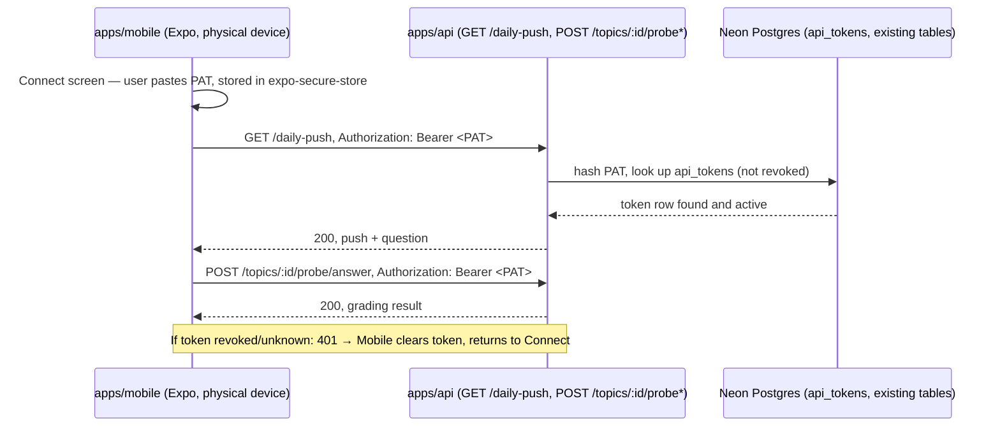

# Mobile study/review app

`apps/mobile` is a new Expo/React Native client of `apps/api` — a fourth client alongside
`apps/web` and `apps/bot`, no parallel backend. It reuses the same REST routes `apps/web`
already calls for the study/review loop: `GET /daily-push`, `POST /topics/:id/probe`,
`POST /topics/:id/probe/answer`. Scope is deliberately narrow: connect with a token, see
today's question, answer it, see the result — no curriculum browsing, admin, stats, chat, or
Electric/local-first sync in this pass.

Mobile now also has a dedicated Practice flow for `language-practice` subjects (phrase-bank
data), separate from the daily-push loop — see "Two entry points" below.

## Authentication: a revocable personal access token, not a login screen

`apps/web`'s existing auth pattern — a static `API_SHARED_SECRET` injected by a same-origin
proxy route — only works because `apps/web` has a server tier to hide the secret in. A native
app has no such tier; embedding `API_SHARED_SECRET` in the app bundle would let anyone who
downloads the app extract and reuse it against production.

Instead, `apps/api`'s single `authorized()` gate grows a second, additive check: a request is
authorized if it presents either the correct shared secret (unchanged, for `apps/web`/`apps/bot`)
or a valid, unrevoked personal access token (PAT), hash-compared against a new `api_tokens`
table. Tokens are minted by a one-off script (`apps/api/scripts/create-api-token.ts`), never an
HTTP endpoint — there is no chicken-and-egg problem, and the trust boundary for "who can create
a credential" stays at "whoever can run scripts against this database," the same boundary
migrations already sit behind. The raw token is shown once and stored only in the device's
secure keychain (`expo-secure-store`), never in plain `AsyncStorage` and never in source control
or the app bundle.

The Connect screen (`apps/mobile/app/connect.tsx`) visibly distinguishes first-time pairing from
post-eviction re-pairing, rather than showing identical copy either way. When `apiFetch`'s 401
branch clears a rejected token, it records `"revoked"` as a module-level, read-once reason in
`apps/mobile/src/api/token-storage.ts` (`clearStoredToken(reason)` / `consumeClearReason()`) —
not a route param. Two independent code paths can both redirect to `/connect` after an eviction
(`apiFetch`'s own imperative redirect, and `_layout.tsx`'s effect reacting to the same
`clearStoredToken` call), so a param threaded through whichever redirect happens to land first
would be unreliable; module state read once when Connect mounts sidesteps that race entirely.
Connect reads the reason once via a lazy `useState` initializer and renders "Your session
ended — reconnect with a new token below." instead of the default first-pairing copy.

`apps/mobile/src/api/client.ts` also guards against a misconfigured, plaintext transport:
`assertSecureUrl(url)` throws for any `http://` URL whose host isn't a recognized loopback address
(`localhost`, `127.0.0.1`, `::1`, `10.0.2.2` — the Android emulator's host-loopback alias); any
`https://` URL passes unchanged. A Bearer PAT read out of the Keychain/Keystore still has to
travel securely once it's on the wire — secure storage alone doesn't guarantee that. The guard
parses the scheme and host with a small regex rather than the built-in `URL`: WHATWG `URL` returns
bracketed IPv6 hostnames (`"[::1]"`), and React Native's own `global.URL` polyfill
(`Libraries/Core/setUpXHR.js`) parses bracketed IPv6 literals differently again — neither can be
trusted to agree with this guard's fixed allowlist, so `new URL()` is deliberately not used here.
The guard is called explicitly at the top of both `apiFetch` and `verifyToken`, deliberately **not**
folded into
`apiBaseUrl()` itself: `verifyToken` wraps its body in `try { ... } catch { return false }`, and if
`apiBaseUrl()` threw from inside that try block the throw would be silently swallowed and
misreported as "That token was rejected" — a server-misconfiguration error masquerading as a bad
token. `assertSecureUrl(apiBaseUrl())` runs before `verifyToken`'s try block instead, so the throw
reaches `connect.tsx`'s `connect()`, which now has its own try/catch showing a distinct "Can't
reach the server — check the app's configured server address." message. `apiFetch` has no try/catch
of its own, so the same guard throw there propagates unchanged to the calling screen's existing
generic error handling — no new UI needed for an already-paired app whose configured URL later
becomes insecure.

## Flow

### Web-platform token storage fallback

`expo-secure-store` has no real implementation on the web target — its web module
(`ExpoSecureStore.web.ts`) is an intentional empty stub. Calling it unconditionally crashes the
app the moment it tries to read the stored token, which stalls `_layout.tsx` on its loading
spinner forever. `apps/mobile/src/api/token-storage.ts` now branches on `Platform.OS === "web"`
to read/write/clear `window.localStorage` instead, mirroring the `Platform.OS === "ios"` pattern
already used in `apps/mobile/app/connect.tsx`. Native iOS/Android storage is unaffected — that
branch still calls `SecureStore.*` exactly as before. This exists to make the app testable via
`expo start --web` + Playwright (this project has no simulator/device — see issue #65); it is not
a production security boundary change, since the app is never shipped to a browser as its primary
target.

## Two entry points: Today vs Practice

The backend has no unified "what's due" concept across pedagogy kinds yet — `GET /daily-push`
only reads the architecture-mentor data model (`curricula`→`topics`→`gaps`); language-practice's
`phrase_bank_entries` hang off a bare `subjectId` with no topic/curriculum, so they're structurally
invisible to `/daily-push`. Mobile therefore has two independent entry points into the same
backend, not one:

- **Today** (`apps/mobile/app/index.tsx`) — `GET /daily-push` auto-selects one due
  architecture-mentor gap and renders it via the existing probe/quiz flow.
- **Practice** (`apps/mobile/app/practice/index.tsx` and `apps/mobile/app/practice/[subjectId].tsx`)
  — the learner picks a language-practice subject from a list (`GET /subjects`, filtered to
  `kind === "language-practice"`, each row showing a due-count from `GET /subjects/:id/phrase-bank`),
  then generates and answers one phrase at a time via `POST /subjects/:id/phrase-batches` and
  `POST /subjects/:id/attempts`.

This mirrors the architecture-mentor screen's one-question/one-answer/one-result rhythm rather
than desktop's chunk-of-5/10 grid with a level/pack picker and phrase-bank archive panel — those
are real desktop features but beyond what a real graded interaction for a language-practice
subject requires. Unifying the two entry points into one cross-kind "what's due today" surface is
tracked separately (issue #58) and is out of scope here.

## What's out of scope

Curriculum browsing/creation, admin settings, stats dashboard, study chat, the richer Socratic
chat-thread UI (`apps/web`'s `SocraticChat`), push notifications, offline caching, multi-user
accounts, Electric/local-first sync, EAS cloud builds or app-store submission, pointing the app at
anything other than a locally-run `apps/api` by default, unifying `/daily-push` across pedagogy
kinds (issue #58), on-device/native verification (issue #65), and language-practice's level/pack
picker, chunked answering, batch prefetching, and phrase-bank archive panel on mobile (desktop-only
features, not required by the Done-when bar this Practice flow satisfies).

See `.planning/mobile-study-review-app/` and `.planning/mobile-study-loop/` for the full spec,
scenarios, and architecture notes this slice was built from.
