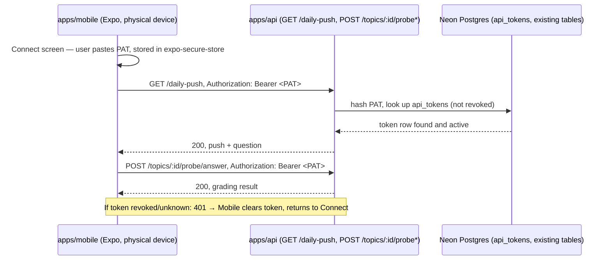

# Mobile study/review app

`apps/mobile` is a new Expo/React Native client of `apps/api` — a fourth client alongside
`apps/web` and `apps/bot`, no parallel backend. It reuses the same REST routes `apps/web`
already calls for the study/review loop: `GET /daily-push`, `POST /topics/:id/probe`,
`POST /topics/:id/probe/answer`. Scope is deliberately narrow: connect with a token, see
today's question, answer it, see the result — no curriculum browsing, admin, stats, chat, or
Electric/local-first sync in this pass.

## Authentication: a revocable personal access token, not a login screen

`apps/web`'s existing auth pattern — a static `API_SHARED_SECRET` injected by a same-origin
proxy route — only works because `apps/web` has a server tier to hide the secret in. A native
app has no such tier; embedding `API_SHARED_SECRET` in the app bundle would let anyone who
downloads the app extract and reuse it against production.

Instead, `apps/api`'s single `authorized()` gate grows a second, additive check: a request is
authorized if it presents either the correct shared secret (unchanged, for `apps/web`/`apps/bot`)
or a valid, unrevoked personal access token (PAT), hash-compared against a new `api_tokens`
table. Tokens are minted by a one-off script (`apps/api/scripts/create-api-token.ts`), never an
HTTP endpoint — there is no chicken-and-egg problem, and the trust boundary for "who can create
a credential" stays at "whoever can run scripts against this database," the same boundary
migrations already sit behind. The raw token is shown once and stored only in the device's
secure keychain (`expo-secure-store`), never in plain `AsyncStorage` and never in source control
or the app bundle.

## Flow

## What's out of scope

Curriculum browsing/creation, admin settings, stats dashboard, study chat, the richer Socratic
chat-thread UI (`apps/web`'s `SocraticChat`), push notifications, offline caching, multi-user
accounts, Electric/local-first sync, EAS cloud builds or app-store submission, and pointing the
app at anything other than a locally-run `apps/api` by default.

See `.planning/mobile-study-review-app/` for the full spec, scenarios, and architecture notes
this slice was built from.
