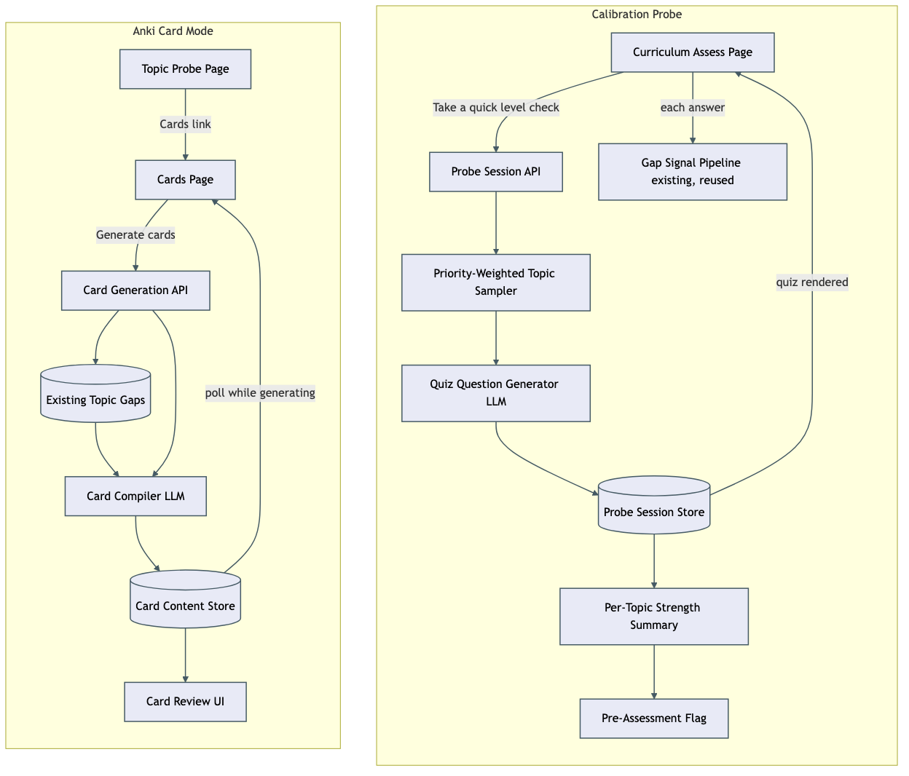

# Architecture Review: curriculum-calibration-probe + anki-card-mode

## What was reviewed

Two new, uncommitted features built in one moonshine-factory run. **Curriculum-calibration-probe**
adds a one-time, ~10-20 question quiz spanning every included topic in a curriculum, taken from the
pre-study "assess" page, that produces a per-topic strong/weak picture instead of manual self-grading
alone. **Anki-card-mode** adds a new per-topic "Cards" view where an AI generates review cards — one
per key concept, each with 3-5 differently-worded prompt/answer variants — reachable from the existing
topic probe page. In scope: every file touched across `packages/shared`, `packages/core`, `apps/api`,
`apps/web`, plus their new e2e coverage in `verification-repo`.

## Documentation found

`.planning/newcomer-onboarding-and-cards/spec.md` and `todo.md` — written at the start of this same
run, not prior planning. `todo.md`'s "Manual steps" section already flags the one real gap this review
also lands on independently (see Verdict): neither feature has been exercised against a real LLM call,
only against unit tests, direct DB/HTTP smoke tests, and mocked-LLM e2e scenarios.

## As-built architecture

**Calibration probe (right):** the Assess page starts a session through the existing Probe Session API,
now extended with a `"curriculum"` scope. A new priority-weighted topic sampler (pure, unit-tested)
picks which topics get questions and how many, capping the batch at 20 and dropping the lowest-priority
topics if a curriculum has more than that. The same quiz-generation LLM call every other probe scope
already uses fills the batch; questions persist with their owning `topicId`. Answering routes through
the **existing, unmodified** gap-signal pipeline — a curriculum-scoped wrong answer produces the same
gap-discovery/depth-signal effect as a topic-scoped one, by construction, since that pipeline keys only
off `question.topicId`. A one-shot guard (checked both server- and client-side) stops this session from
being auto-replenished like an ongoing practice queue would be. On completion, a summary derives
strong/weak/mixed per topic and flips the curriculum's pre-assessment flag.

**Anki cards (left):** reached from the topic probe page's new "Cards" link. Generation is
button-gated — nothing auto-fires — and grounds entirely in data the app already has (the topic's
title/summary and its existing gaps), deliberately skipping the external web-research step the sibling
Lecture feature does, since cards test recall of what's already established rather than sourcing new
content. The compiler LLM's structured output replaces the topic's card set in one delete-then-reinsert
pass across three tables (sets → cards → variants), mirroring Lecture's own two-level version of the
same pattern one level deeper. The client polls while status is `generating`, matching Lecture's UX
exactly.

## Verdict

**Sound.** Both features extend existing, working patterns (the probe-session scope system; the
Lecture generate-persist-poll shape) rather than inventing new ones, and both were independently
re-verified at every stage of this run — not just taken on the implementing subagent's word — via
direct citation spot-checks, independent typecheck/test re-runs, curl smoke tests against the real
local API, and headless e2e re-runs by the orchestrator. No critical-bar issue (data loss, security
exposure, outage/cost runaway, single point of failure, or blocking coupling) was found in either.

Two real tradeoffs are worth naming plainly, both **inherited from the existing codebase, not
introduced by this work**:

1. **Non-transactional multi-table replace.** `cards.repo.ts`'s `replaceCardsContent` deletes and
   reinserts across three tables without wrapping in a DB transaction — a crash mid-sequence could
   leave a card set stuck on `generating` with a partially-rebuilt content tree. This is not a new
   risk this work introduced; it's the identical pattern `lecture.repo.ts`'s `replaceLectureContent`
   already uses in production. Consistent with the codebase's existing risk tolerance, but now
   replicated into a second feature rather than fixed once.
2. **Click-triggered LLM spend has no cooldown.** Both Lecture and Cards re-enable their generate
   button as soon as the 202 response lands, not when generation actually finishes server-side — a
   fast double-click can fire two concurrent compile calls for the same topic. Same shared,
   pre-existing gap, not new here.

Neither crosses the bar for a blocking finding at this app's actual scale (single-owner, personal,
low request volume) — they're flagged as known shared debt, not as reasons to hold this work back.

## Questions a reviewer would ask

1. `replaceCardsContent`'s three-table delete-then-reinsert isn't wrapped in a transaction (matching
   Lecture) — what's the actual blast radius if the process dies between the `topic_cards` delete and
   the `topic_card_variants` reinsert? Is a stuck `generating` status recoverable by the existing
   retry button, or does it need a manual DB fix?
2. The calibration probe fires the same gap-discovery logic that Socratic conversation normally
   triggers, but for topics the learner may never have had a conversation about at all — does firing
   10-20 gap-discovery events from one MCQ batch produce gaps of the same quality/granularity as
   organically-discovered ones, or does it front-load noisier gaps before any real learning conversation
   has happened?
3. `isOneShotProbeScope` has to be checked in two independent places (server `maybeReplenish`, client
   refetch-on-low) for the guard to actually hold — what stops a future new `ProbeScope` value from
   forgetting one of the two checks, since nothing enforces they move together?
4. `planCurriculumQuizDistribution` silently drops the lowest-priority topics past a 20-topic cap —
   does the learner ever see which topics got skipped from their level check, or could "an approximate
   picture of what I don't know" reasonably be expected to cover every included topic regardless of
   count?
5. Both features were verified against mocked LLM responses in e2e and hand-traced logic otherwise —
   never against a real OpenRouter call, since the local dev DB has zero curricula. What's the actual
   risk that a real model's phrasing breaks the topic-attribution `normalize()` match the whole
   calibration-probe feature depends on to group results correctly per topic?
6. Cards generation reuses the topic's already-known gaps as grounding but explicitly skips new web
   research (unlike Lecture) — for a topic with zero recorded gaps yet, is "cover the topic's key
   concepts broadly" (the fallback prompt instruction) enough guidance for the model to produce
   genuinely varied, non-generic cards, or does that path need its own verification once a real
   curriculum exists locally?
