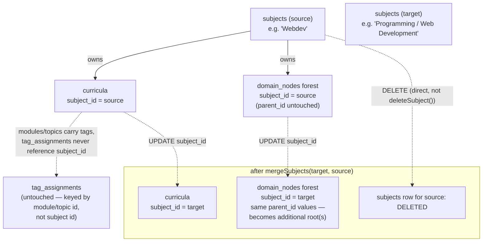
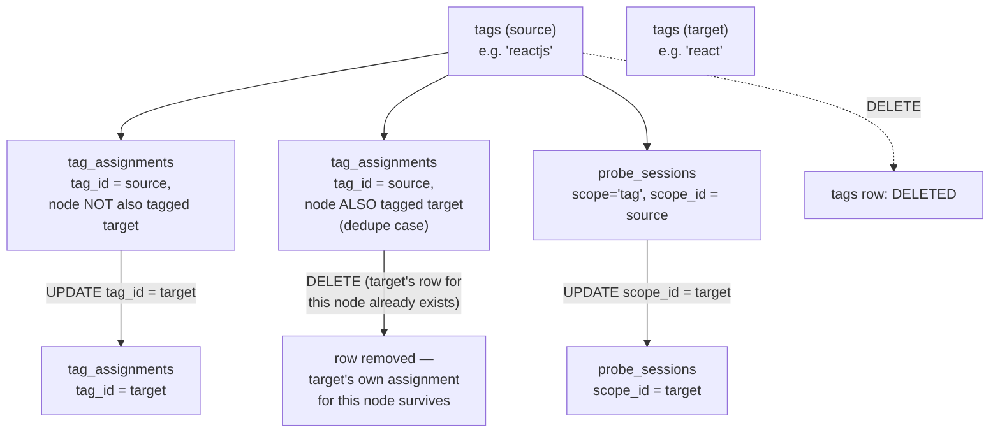
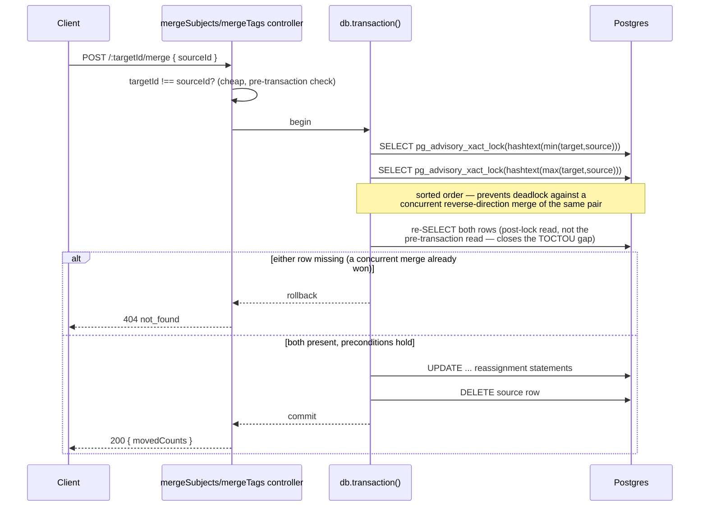
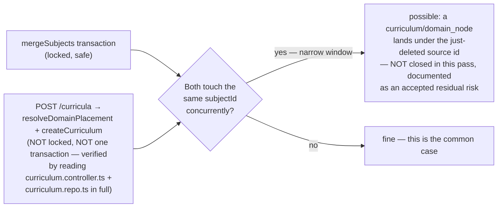

# Architecture — Subject, Tag, and Curriculum merge

This doc originally covered Subject and Tag merge only (issue #56). `curriculum-merge` (issue #60)
completes the merge trio using the exact same mechanism, generalized to a nested child set (modules
→ topics) — see "What merge actually moves — Curriculum merge" below, added in that pass rather than
opened as a parallel doc, since it is the same mechanism, not a new one.

## Why this plan gets an architecture.md

Per this project's own trigger rule: this introduces a new atomic, cross-table write pattern
(reassign-then-delete under an advisory lock) that two entity types (Subject, Tag) both use — a new
decision-making shape sitting beside the existing simple create/delete repo functions, not a
feature bolted onto an existing single-table CRUD path. It also touches a real, previously-flagged
concurrency and cycle-safety concern from the prior item (seed-knowledge-map), so the reasoning
needs to be visible in one place, not just in scattered code comments.

## What merge actually moves — Subject merge

Two facts this diagram encodes and the code must preserve:

1. `tag_assignments` is never touched by a subject merge — it is keyed by `(nodeType, nodeId)`
   where `nodeId` is a module or topic id, and those ids don't change when their owning
   curriculum's `subject_id` changes. A tagged module survives a subject merge with zero writes to
   its tag.
2. `domain_nodes.parent_id` is never touched — only `subject_id`. The forest's internal shape
   (who's whose parent) is preserved byte-for-byte; it just now belongs to a different subject and
   contributes additional root(s) to that subject's tree. `getDomainMapForSubject`'s existing
   `nodeRows.filter(row => row.parentId === null)` root-detection already handles multiple roots —
   confirmed by reading that function; this needed zero code change.

## What merge actually moves — Tag merge

The dedupe delete (step 3 in the merge procedure) runs before the bulk `UPDATE` (step 4) — running
them in the other order would have the bulk update collide with `tag_assignments_tag_node_unique`
on the very rows the dedupe step exists to clear first.

## Advisory-lock sequencing (both merge endpoints)

Proven by a real-Postgres integration test firing two concurrent `mergeSubjects()` calls via
`Promise.all` (`apps/api/src/subject/subject-merge-concurrency.integration.test.ts`) — exactly one
call succeeds with the correct moved counts, the other resolves with a clean `{ error: "not_found" }`,
never a thrown exception and never a state where the source's children end up attached to neither
target.

## What this plan deliberately does NOT close

Closing this fully means wrapping `resolveDomainPlacement` + `createCurriculum` in one transaction
carrying the same `pg_advisory_xact_lock` — a three-file refactor
(`domain-placement.orchestrator.ts`, `domain-map.repo.ts`, `curriculum.repo.ts`) of a hot,
currently-working, frequently-exercised path. Deferred as a fast-follow, matching this project's
own precedent of shipping a primary concurrency fix and logging a residual edge separately
(`phrase-bank-concurrency-fix` → the still-open "Close a real deadlock window..." wishlist item).

## Cycle-guard non-issue (verified, not assumed)

`domain-map.repo.ts`'s `getDomainMapForSubject`/`buildItem` tree-assembly recursion has no cycle
guard, unlike `packages/core/src/domain-map/domain-map-progress.ts`'s `domainNodeProgress` (which
has a visited-set + depth cap of 6). This plan does not add a re-parenting write path — subject
merge changes `domain_nodes.subject_id` only, never `parent_id`. Every `parent_id` write site in
the codebase (`insertDomainNode` in `domain-map.repo.ts`, the node-creation call in
`domain-placement.orchestrator.ts`) was grepped and confirmed to set it only at row-creation time.
The missing cycle guard is real but is not exercised by anything this plan builds — it remains a
prerequisite for the future split fast-follow, which WILL need to re-parent subtrees.

## What merge actually moves — Curriculum merge (issue #60)

```mermaid
flowchart TB
  curriculaSource["curricula (source)<br/>e.g. 'React Hooks (old)'"]
  curriculaTarget["curricula (target)<br/>e.g. 'React Hooks (new)'"]
  modulesSource["modules<br/>curriculum_id = source"]
  topicsSource["topics<br/>curriculum_id = source<br/>(denormalized alongside module_id)"]
  sourcesSource["sources<br/>curriculum_id = source"]
  socraticSource["socratic_sessions<br/>curriculum_id = source"]
  probeSource["probe_sessions<br/>curriculum_id = source (nullable)"]
  turnsSource["curriculum_structure_turns<br/>curriculum_id = source"]
  candidatesSource["structure_research_candidates<br/>curriculum_id = source"]
  llmSource["llm_call_events<br/>curriculum_id = source (nullable)"]
  gapsUntouched["gaps / gap_mastery / tag_assignments /<br/>lectures / probe_session_questions<br/>(keyed by topic_id/module_id/gap_id,<br/>never curriculum_id — untouched by construction)"]

  curriculaSource --> modulesSource
  curriculaSource --> topicsSource
  curriculaSource --> sourcesSource
  curriculaSource --> socraticSource
  curriculaSource --> probeSource
  curriculaSource --> turnsSource
  curriculaSource --> candidatesSource
  curriculaSource --> llmSource
  modulesSource -.->|"module/topic ids stable"| gapsUntouched

  subgraph AfterMerge["after mergeCurricula(target, source)"]
    direction TB
    modulesMoved["modules<br/>curriculum_id = target<br/>order += target's current max"]
    topicsMoved["topics<br/>curriculum_id = target"]
    sourcesMoved["sources<br/>curriculum_id = target"]
    socraticMoved["socratic_sessions<br/>curriculum_id = target"]
    probeMoved["probe_sessions<br/>curriculum_id = target"]
    turnsDeleted["curriculum_structure_turns: DELETED"]
    candidatesDeleted["structure_research_candidates: DELETED"]
    llmDangling["llm_call_events: left pointing at<br/>the now-deleted source id (deliberate)"]
    sourceDeleted["curricula row for source: DELETED"]
  end

  modulesSource -.->|"UPDATE curriculum_id, order offset"| modulesMoved
  topicsSource -.->|"UPDATE curriculum_id"| topicsMoved
  sourcesSource -.->|"UPDATE curriculum_id"| sourcesMoved
  socraticSource -.->|"UPDATE curriculum_id"| socraticMoved
  probeSource -.->|"UPDATE curriculum_id"| probeMoved
  turnsSource -.->|"DELETE"| turnsDeleted
  candidatesSource -.->|"DELETE"| candidatesDeleted
  llmSource -.->|"left alone"| llmDangling
  curriculaSource -.->|"DELETE (direct, not deleteCurriculum())"| sourceDeleted
```

Two things this diagram encodes that don't appear in the Subject/Tag merges above:

1. **A nested child set.** B's modules become additional modules under A (no title-matching
   reconciliation attempted), with `topics.curriculum_id` reassigned in the SAME statement class as
   `modules.curriculum_id` (`getCurriculumDetail` fetches topics by `curriculum_id` directly — a
   forgotten topic reassignment would silently render moved modules with zero topics), and the
   source's module `order` values offset past the target's current max so the two independently-
   numbered sequences don't interleave under `sortForDisplay`.
2. **The one new precondition subject/tag merge never needed:** `curriculum_structure_turns` and
   `structure_research_candidates` are DELETED for the source (not reassigned), and the merge refuses
   outright (400 `pending_structure_turn`) if the SOURCE has an assistant turn still mid-generation —
   reassigning risks colliding with `curriculum_structure_turns_pending_assistant_unique` and always
   produces an incoherent interleaved chat thread. Scoped to the source only: the target's own pending
   turns are never touched by this merge, so checking them too would reject legitimate merges for no
   real hazard. `llm_call_events` is left dangling on purpose, same reasoning as an append-only
   observability log anywhere else — reassigning it would misrepresent which curriculum an LLM call
   actually ran against.

Proven by two real-Postgres integration tests: `curriculum-merge-concurrency.integration.test.ts`
(the same double-merge race proof as Subject/Tag merge above, applied to `mergeCurricula`) and
`curriculum-merge-pending-turn-precondition.integration.test.ts` (the source-only precondition, both
directions).

## Shared locking helper — `withMergeLock`

All three merge functions (`mergeSubjects`, `mergeTags`, `mergeCurricula`) share an identical
locking preamble — self-merge guard, sorted-pair `pg_advisory_xact_lock`, opening the transaction —
extracted once curriculum merge became the third copy into `apps/api/src/shared/merge-lock.ts`'s
`withMergeLock(targetId, sourceId, run)`. It owns only that preamble; each caller's own `run`
callback still does its own entity-specific re-read, its own preconditions (`kind_mismatch`,
`different_subjects`/`pending_structure_turn`), and its own reassignment body — the three bodies
share nothing beyond the lock itself. `mergeSubjects`/`mergeTags` were refactored onto this helper in
the same change, verified by re-running their existing integration test suites
(`subject-merge-concurrency.integration.test.ts`, `tag-merge.integration.test.ts`) — both stayed
green, so the back-port shipped rather than being reverted.

## What this plan does not change

- `curricula`, `domain_nodes`, `tags`, `tag_assignments`, `probe_sessions`, `modules`, `topics`,
  `sources`, `socratic_sessions`, `curriculum_structure_turns`, `structure_research_candidates`,
  `llm_call_events` table shapes — no migration.
- `deleteSubject()`'s existing pre-existing orphaning of `domain_nodes` on subject delete — a
  separate, pre-existing gap, out of scope here (this plan's merge deliberately avoids calling that
  function, but does not fix its own bug). `deleteCurriculum()` is the same story for curriculum
  merge — avoided, not fixed.
- The domain-map read path (`GET /subjects/:id/domain-map`) — the multiple-roots-per-subject case
  this plan produces is already handled by existing code, confirmed by reading it, zero changes
  required there. `curricula.domain_node_id` on a merged-away curriculum is simply dropped — the same
  "a node with zero placed curricula" state already representable via a plain curriculum delete.
- The `saveCurriculumPlan`/`createCurriculum`-vs-merge concurrency window, and its curriculum-merge
  sibling (`reparseCurriculum`/`retryResearch`'s `clearCurriculumStructure()` racing a concurrent
  merge that just moved modules in) — both documented, not closed, in the same spirit as the
  `createCurriculum`-vs-subject-merge race below.

## As-built — endpoints and files

- `POST /subjects/:targetId/merge` — `apps/api/src/subject/subject.repo.ts`'s `mergeSubjects()`,
  wired through `subject.controller.ts`'s `handleMergeSubjects` and `router.ts`.
- `POST /tags/:targetId/merge` — `apps/api/src/tag/tag.repo.ts`'s `mergeTags()`, wired through
  `tag.service.ts`'s `mergeTagsService` passthrough, `tag.controller.ts`'s `handleMergeTags`, and
  `router.ts`.
- `POST /curricula/:targetId/merge` — `apps/api/src/curriculum/curriculum.repo.ts`'s
  `mergeCurricula()`, wired through `curriculum.controller.ts`'s `handleMergeCurricula` and
  `router.ts`.
- All three share `apps/api/src/shared/merge-lock.ts`'s `withMergeLock()` for the locking preamble.
- Frontend: `MergeSubjectButton` in `apps/web/src/subject/subject-section.tsx` (gated to
  `kind === 'architecture-mentor'`, `allSubjects` prop threaded from `routes/index.tsx`'s
  `HomeView`); `TagMergeControl` in `apps/web/src/routes/index.tsx`'s `TagList`; `MergeCurriculumButton`
  in `apps/web/src/subject/subject-section.tsx`, next to each curriculum's `DeleteCurriculumButton`,
  sourced from the same subject-filtered `curricula` prop `SubjectSection` already receives.
- Verified end to end via `apps/api/src/subject/subject-merge-concurrency.integration.test.ts`
  (Scenario 5), `apps/api/src/tag/tag-merge.integration.test.ts` (Scenarios 3 backend-proof + 4),
  `apps/api/src/curriculum/curriculum-merge-concurrency.integration.test.ts` (Scenario 3) and
  `apps/api/src/curriculum/curriculum-merge-pending-turn-precondition.integration.test.ts`
  (Scenario 4), and five Playwright e2e scenarios in verification-repo
  (`@ontology-split-merge.S1`/`S2`/`S3`, `@curriculum-merge.S1`/`S2`).
