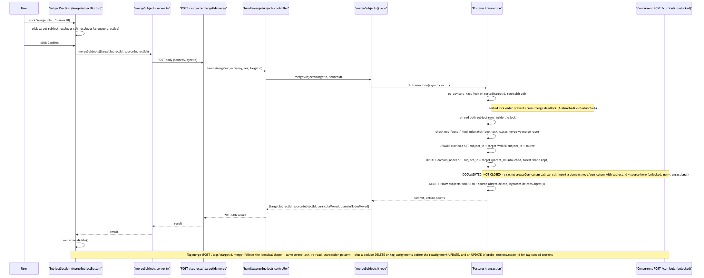

# Architecture Review: Subject and tag merge

## What was reviewed

Two new destructive-but-guarded operations — `POST /subjects/:id/merge` and `POST /tags/:id/merge`
— that absorb one subject/tag into another: children are reassigned, the source row is deleted,
and the whole thing runs inside one advisory-lock-guarded Postgres transaction to make concurrent
merges of the same entity fail cleanly instead of racing. In scope: `apps/api/src/subject/subject.repo.ts`
+ `subject.controller.ts`, `apps/api/src/tag/tag.repo.ts` + `tag.controller.ts`, the two new
integration test files, `router.ts`/`server.ts` wiring, and the frontend confirm-arm UI in
`subject-section.tsx` and `routes/index.tsx`. Commit `ea9ddfd` (merged via `a9334c2`).

## Documentation found

`.planning/ontology-split-merge/` (spec.md, scenarios.md, architecture.md, discussion.md,
playwright.md, state-fixtures.md, plan-summary.md, e2e-tests.md) — all `state: confirmed`, and a
plain-doc `docs/architecture/ontology-split-merge.md` published by the build agent. `.planning/LOG.md`'s
08:10 entry is the build-and-review record: it reports the actual merged `mergeSubjects()` was read
line by line, both integration test files were independently re-run (6/6) plus the full API suite
(208/208), and a `review-playwright` pass verdicted sound with a zero-orphan SQL proof passing on
every execution where the merge itself ran (one e2e scenario flaked ~25% on a pre-existing
tag-picker hydration race in test setup, unrelated to the merge logic). That same entry discloses
an incident: the review agent accidentally ran a bare `db:migrate` against the production Neon
database instead of the e2e-scoped script, caught itself immediately, verified via read-only query
that the migration had already been applied two hours earlier by an unrelated deploy, and confirmed
net effect zero. Read against the actual code (below), every specific claim in the plan and the log
holds up — no drift found between what was documented and what shipped.

## As-built architecture

Entry point is a two-step confirm-arm UI on the subject/tag card (same pattern as the existing
`DeleteSubjectButton`) — click "Merge into…", pick a target from a filtered dropdown (excludes
self; for subjects, excludes anything not `kind: "architecture-mentor"`), click Confirm. The server
function calls the merge endpoint, which opens one `db.transaction()`, acquires
`pg_advisory_xact_lock(hashtext(id))` for both ids in **sorted lexicographic order** (this is what
prevents a deadlock between `A-absorbs-B` and `B-absorbs-A` racing each other), then re-reads both
rows *inside* the lock and re-checks preconditions there — not before acquiring it, which is what
makes the merge-vs-merge race resolve to a clean 404 on the loser rather than a partial write. For
subjects: `curricula` and `domain_nodes` get `subject_id` reassigned (`parent_id` is never touched,
so the moved forest keeps its shape and becomes extra roots under the target), then the source row
is deleted directly. For tags: a dedupe `DELETE` on `tag_assignments` runs before the bulk
reassignment `UPDATE` (ordering matters here — skipping the dedupe step would hit the
`tag_assignments_tag_node_unique` constraint), then any tag-scoped `probe_sessions.scope_id` is
also reassigned. The one documented gap sits outside this transaction entirely: `POST /curricula`
reads the subject's existence once, up front, then runs `resolveDomainPlacement` and
`createCurriculum` as two separate, unlocked, non-transactional statements — a merge that runs in
between can delete the subject those statements are about to write against.

## Verdict

**Sound.** I independently verified, by reading the code (not by trusting the plan or the log),
each of the three specific risk areas flagged for this review:

**The `createCurriculum`-vs-merge race judgment call holds up.** I traced `handleCreateCurriculum`
myself: `getSubject()` is read once at the top of the handler, then `resolveDomainPlacement` and
`createCurriculum` run later in the same handler as two unlocked statements with no re-check. If a
merge deletes the source subject in that window, the resulting `domain_node`/`curriculum` rows land
with a `subject_id` that no longer exists in `subjects` — silently orphaned, since this schema has
no foreign keys to reject the insert. That's a real gap. But the failure mode is data going
*invisible*, not corrupted: the row still exists, still has valid data, just isn't reachable from
any subject the UI shows, until someone queries it directly by the dead id. Triggering it requires
the single operator to fire "create a curriculum under subject X" and "merge subject X away" as two
separate UI actions within roughly the same few hundred milliseconds — an accidental double-click
inside one form doesn't reach this path; it requires acting on two different cards. Given this is a
single-user app and the project has an established precedent for exactly this tradeoff
(`phrase-bank-concurrency-fix` shipped its primary fix and logged a similar residual race as a
fast-follow rather than blocking), deferring this one is consistent, not corner-cutting. I'd treat
it the same way the plan does: real, logged, low-probability, correctly not blocking.

**Bypassing `deleteSubject()` does not skip anything it normally handles.** I read `deleteSubject()`
in full: it does exactly two things — cascade-delete every owned curriculum via `deleteCurriculum()`,
then delete the subject row. No audit write, no cache invalidation, no other side effect exists in
that function. Merge's direct `DELETE FROM subjects` is called only *after* every curriculum and
domain node has already been moved off the source subject, so by the time the delete runs, calling
`deleteSubject()` instead would be a no-op-equivalent (zero owned curricula left) followed by the
same row delete — merge's direct delete is behaviorally identical, not a shortcut past something
real. One thing this review turned up as a side finding, consistent with what the plan itself
already flagged: `deleteSubject()` never touches `domain_nodes` at all — a subject deleted the
ordinary way (not via merge) leaves its domain-node forest orphaned today. That's a pre-existing gap
in `deleteSubject()`, not something this feature introduced or made worse.

**Merge being irreversible with no audit trail is consistent with this codebase's existing
convention, not a new gap.** `deleteSubject()` and `deleteCurriculum()` already have no undo and no
audit trail — there is no audit-log table anywhere in this schema. Merge doesn't regress an existing
standard; it matches the one that's already there. What tips this from "acceptable" to "worth a
question" is likelihood of accidental trigger, not severity: a wrong-target delete on your own
subject requires clicking delete on the thing you meant to delete, but a wrong-target *merge*
requires picking correctly from a dropdown of every other subject — a fat-fingered selection
silently folds real data into the wrong place with no error shown (see below) and no way back
except restoring from a database backup. The UI does mitigate this somewhat with the existing
confirm-arm pattern (arm, then a separate Confirm click), which is the same friction the codebase
already accepts as sufficient for delete.

**One real, minor gap found that wasn't in the original scrutiny list**: `MergeSubjectButton`'s
`confirm()` handler has no `try`/`catch` around the `mergeSubjects()` call. If the request throws
(the merge-vs-merge race resolving to a 404 on this tab, a stale `kind_mismatch`, a network error),
`setBusy(false)` on the next line never runs — the Confirm button stays disabled until the page is
reloaded. This is not a merge-specific mistake: `DeleteSubjectButton`'s `confirm()` has the exact
same shape, so this is an existing house-style gap this feature inherited rather than introduced.
Below the bar for escalation (a stuck button, not silent data loss), but worth naming since it means
a failed merge currently gives the user no feedback at all.

None of the above clears the escalation bar (data loss/corruption, security exposure, an outage or
runaway-cost path, a SPOF, or blocking near-term planned work). The advisory-lock design correctly
closes the one race this feature's own transaction boundary can close, and both things I checked
that could have been silent regressions — the `deleteSubject()` bypass and the no-FK child
enumeration — check out against the actual code, not just the plan's claim about the code.

## Questions a reviewer would ask

1. The `createCurriculum`-vs-merge race is deferred with a written rationale, but is there any
   monitoring or later cleanup — even a manual query — planned to catch domain_nodes/curricula
   whose `subject_id` no longer resolves to any row in `subjects`, in case this race ever does fire?
2. `MergeSubjectButton`'s dropdown is built from `allSubjects` passed down at page-load time — if a
   second browser tab merges away a subject, does the first tab's dropdown ever go stale, and if it
   does, what does clicking Confirm on a since-deleted target actually show the user (right now:
   nothing, per the missing try/catch)?
3. Now that `deleteSubject()`'s domain_nodes-orphaning gap has been independently reconfirmed here
   as pre-existing rather than caused by this feature, is a fast-follow for that already tracked, or
   does it need to be filed?
4. Is there any plan to surface `curriculaMoved`/`domainNodesMoved`/`assignmentsMoved` (already
   returned by both endpoints) in the UI, so a user gets confirmation of what actually moved, given
   merge has no undo?
5. The dedupe-then-reassign ordering in `mergeTags` is called out as load-bearing in a code comment
   — is there a test that would fail loudly (not just silently produce a constraint-violation 500)
   if someone later reorders those two statements?
6. Tag merge's `assignmentsDeduped` count comes from `rowCount` on a raw `sql` template rather than
   Drizzle's typed query builder (unlike the subject merge, which uses `.returning()`) — was that a
   deliberate choice because the `IN (SELECT …)` shape doesn't map cleanly to the builder, or worth
   revisiting for consistency?
7. Given the single-user framing is doing real work in the risk judgment for the deferred race, is
   that assumption documented anywhere enforceable (config, comment, README), or does it live only
   in planning docs — i.e. would a future multi-user pivot have an obvious trigger to revisit this?
