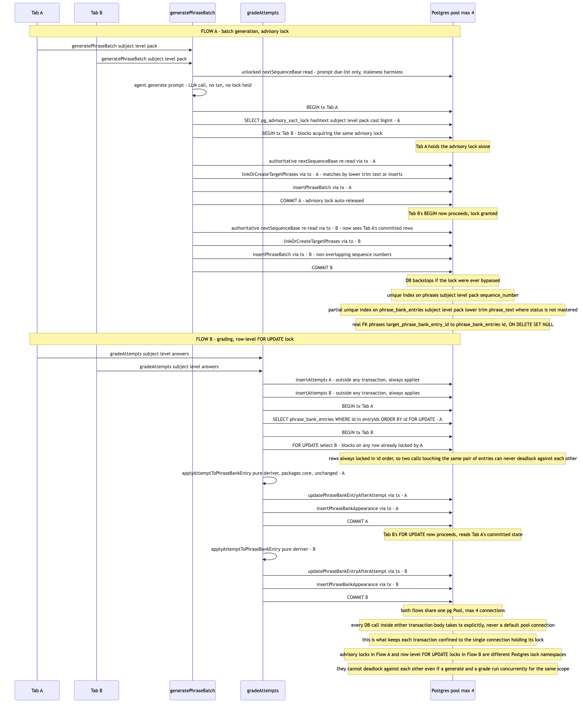

# Architecture Review: Phrase-bank concurrency and data-integrity fix

## What was reviewed

Commit `47ff4cd` (merged to `main` via `6a82979`), diffed against its parent. This closes the three
races and the missing foreign key that `docs/architecture/phrase-bank-mastery/review.md` (the prior
debrief, 2026-07-25) found in the phrase-bank feature: no DB-level FK on
`phrases.targetPhraseBankEntryId`, an unlocked `MAX(sequence_number)` read that two concurrent
batch-generation calls could race, an unlocked read-then-insert that could create two
`phrase_bank_entries` rows for the same phrase text, and an unconditional `UPDATE` that could let a
second concurrent grading call silently overwrite a first one's mastery progress. In scope:
`apps/api/src/db/schema.ts` and its new migration, `phrase-bank.repo.ts`, `practice.repo.ts`,
`generate-phrase-batch.orchestrator.ts`, `grade-attempts.orchestrator.ts`, and the two new
`*.integration.test.ts` files that prove the fix against a real Postgres instance rather than a
mocked one. This is the first place in the codebase using a real `db.transaction()`, a Postgres
advisory lock, or a `SELECT ... FOR UPDATE` row lock — confirmed by grep, no `.transaction(` call
existed anywhere under `apps/api/src` before this commit.

## Documentation found

`.planning/phrase-bank-concurrency-fix/{spec.md,architecture.md,discussion.md,scenarios.md,
playwright.md,state-fixtures.md}` — planning documentation of unusual depth for a "medium"
complexity task. `architecture.md` names the current codebase pattern explicitly (every existing
repo function calls the shared pool directly, one statement at a time) and reasons through where the
lock boundary should sit relative to the LLM call. `discussion.md` is a self-run red-team pass
(`/grill-me` discipline, done by the planning agent against its own draft, no human interview
happened — this was a `/grand-loop` overnight run) that already asked "could the two lock types
deadlock against each other?" (Q5) and answered no, with the reasoning "generate never takes a row
lock, grade never takes an advisory lock." Verified the actual merged code against this document line
by line rather than trusting the summary — see Verdict for where that specific answer turns out to be
wrong, and why it still doesn't change the overall verdict.

## As-built architecture

`generatePhraseBatch` does an early, unlocked `nextSequenceBase` read used only to build the
recycling prompt (staleness here is harmless — worst case a phrase gets recycled a batch earlier or
later). The LLM call runs with no DB connection or lock held. Only then does it open
`getDb().transaction(...)`, take `pg_advisory_xact_lock(hashtext(subjectId||level||pack)::bigint)`
as the transaction's first statement, and — inside that lock — re-read `nextSequenceBase`
authoritatively, link-or-create the target `phrase_bank_entries` rows, and bulk-insert the `phrases`
rows, all through the same `tx` executor. `gradeAttempts` inserts `attempts` unconditionally outside
any transaction (unaffected by anything downstream), then opens its own transaction and reads the
touched `phrase_bank_entries` rows via `SELECT ... FOR UPDATE ... ORDER BY id` — locked in a fixed
order so two concurrent grading calls touching the same pair of entries can never acquire them in
opposite order — computes the next state through the unchanged pure deriver
(`applyAttemptToPhraseBankEntry`), and writes the update plus an appearance row per outcome,
sequentially, inside the same transaction. Two DB-level backstops exist under both paths regardless
of whether the lock is ever bypassed: a unique index on `phrases(subject_id, level, pack,
sequence_number)`, and a **partial** unique index on `phrase_bank_entries(subject_id, level, pack,
lower(trim(phrase_text)))` excluding `status = 'mastered'` — a plain, non-partial version of this
index was drafted first and caught by the project's own integration test as a regression (a mastered
phrase reintroduced later would have 500'd), fixed before merge. The new real FK
(`phrases.target_phrase_bank_entry_id → phrase_bank_entries.id`, `ON DELETE SET NULL`) is what turns
out to matter most for the finding below: it means an insert into `phrases` now takes an implicit row
lock on the `phrase_bank_entries` row it references.

## Verdict

**Sound.** The code matches the plan closely — every function called from inside either locked
transaction body takes the transaction executor explicitly, with no silent fallback to a second pool
connection (verified by reading both orchestrators end to end, not just trusting the plan's claim);
the deriver and API response shapes are genuinely untouched; the 15 new integration tests
(`migrations.integration.test.ts` + `phrase-bank-concurrency.integration.test.ts`) run against a
real, disposable Postgres instance and explicitly assert both concurrent calls succeed via
`Promise.all` before checking for corruption, closing the exact "vacuous pass" hole the plan's own
red-team pass had already caught before implementation. This closes all three races and the missing
FK the prior debrief named, cleanly.

**One real gap the plan's own self-grill got wrong, worth naming plainly rather than folding into
"sound" silently.** `discussion.md`'s Q5 states "generate never takes a row lock" as the reason the
advisory lock (generate) and the `FOR UPDATE` row lock (grade) can't deadlock against each other.
That's incorrect once the new FK is accounted for: Postgres enforces a foreign key by taking a `FOR
KEY SHARE` lock on the referenced row for every insert that carries a non-null reference — so
`insertPhraseBatch` inserting a `phrases` row with a real `target_phrase_bank_entry_id` **does** take
a row lock on the referenced `phrase_bank_entries` row, automatically, as part of normal FK
enforcement. `FOR KEY SHARE` conflicts with `FOR UPDATE`. This means the two write paths can contend
on the same rows after all, and Postgres's deadlock detector spans all lock types together — it's one
wait-for graph, not two separate namespaces the way the self-grill assumed.

The concrete cycle: a `generatePhraseBatch` call recycling two due entries locks them in whatever
order the LLM returned them (generation order); a concurrent `gradeAttempts` call touching the same
two entries locks them via `ORDER BY id`. If those two orderings disagree — nothing prevents them
from disagreeing, since one is model-output order and the other is primary-key order — each
transaction can end up holding one lock and waiting on the other, in opposite order. Postgres detects
this after `deadlock_timeout` and aborts one side with error `40P01`. This is reachable under the
exact scenario this whole fix exists for: one tab generating while another grades, same
subject/level/pack, at least two overlapping recycled phrase-bank entries (recycling caps at
`MAX_DUE_PER_BATCH = 3`, so the window isn't wide, but it's not zero either).

**Why this doesn't cross the escalation bar.** A Postgres deadlock abort is a clean, atomic rollback
of one transaction, not data corruption — the loser transaction's writes never land, and the winner's
proceed normally. On the generate side this surfaces as a 500 to the frontend for that one call, with
nothing left half-written. On the grade side it lands on a failure path the prior debrief already
named and the plan explicitly, correctly left out of scope: `insertAttempts` has already committed by
the time `applyPhraseBankUpdates` would hit this, so the same "answers were actually saved but the
response says it failed" gap applies here too — not a new problem, the same one under a new trigger.
Given this is a single-owner local app (per `verification-repo/projects/post-anki/post-anki/
project.json`), the realistic frequency of this exact interleaving is low, and the failure mode is a
loud, safe rollback rather than silent corruption — which is precisely the category of finding this
plan set out to convert every race into. It does not meet this review's bar for data
loss/corruption, a security exposure, an outage/cost-runaway path, or a SPOF that matters, so no
proposed-alternative diagram follows. It is, however, a real gap in the stated design property ("the
two lock types cannot deadlock"), not just a style note, and belongs in front of whoever picks up the
next phrase-bank task rather than staying buried in a self-grill answer that turns out to be wrong.

**A second, smaller finding: the proof this fix works is not wired into anything repeatable.** The
two new `*.integration.test.ts` files are deliberately excluded from `npm run test`
(`apps/api/vitest.config.ts`) since they hit a real Postgres instance — a sound choice on its own.
But no `package.json` script (in `apps/api` or the root) and no GitHub Actions workflow
(`.github/workflows/` contains only `deploy.yml`) invokes them. The only way to run the 15 tests that
prove all three races are actually closed is to type the exact `npx vitest run <path> <path>`
invocation from `spec.md`'s Definition of Done by hand. They ran once, at build time, and passed
(`review-playwright`'s own verdict, independently re-confirmed per the LOG entry) — but nothing
re-runs them if a future change to either orchestrator or the schema reintroduces one of these races.
This is a real, if minor, coverage-durability gap, not a correctness problem with the fix itself.

## Questions a reviewer would ask

- Given the FK-enforcement lock means generate and grade *can* contend on the same rows after all,
  should the grade path also take `pg_advisory_xact_lock(hashtext(subjectId||level||pack)::bigint)`
  before its `FOR UPDATE` select — making the two write paths for a given scope fully mutually
  exclusive rather than only safe within each type — closing the cross-type deadlock window this
  review found?
- Is there a reason to keep the 15 integration tests invocable only by hand, or should a
  `test:integration` script (and, separately, a decision on whether it belongs in CI given it needs a
  real Postgres) get added so this proof doesn't silently go stale?
- The new FK's `ON DELETE SET NULL` is explicitly justified by "nothing deletes a
  `phrase_bank_entries` row today" — the moment a delete path is ever added, does
  `resolveTargetPhraseBankEntryIds`' echo validation (which reads the due-set outside the write
  transaction and is never re-checked inside it) still hold, or does that become a live race between
  "id was valid when read" and "id got deleted before the insert committed"?
- `docs/architecture/phrase-bank-mastery/as-built.mmd` was regenerated by this same commit to show
  the new locked shape — was that intentionally kept as a second, narrower diagram alongside this
  review's own `phrase-bank-concurrency-fix/as-built.mmd`, or should one now defer to the other as
  the authoritative source so they can't drift apart the way the original `as-built.mmd` already did
  once before this fix?
- `architecture.md` names a "pre-migration safety check" (a read-only scan for existing dangling FKs
  or duplicate rows) as required before this migration runs against real data, not just the
  disposable e2e database — has that actually been run against the local dev Postgres on `:5437`
  yet, or is migration `0019` still only applied to the e2e instance the tests use?
- The advisory lock key is `hashtext(subjectId || level || pack)` with no separator between the
  concatenated parts — could two different scopes ever produce the same concatenated string through
  a different split (e.g. subject `"ab"` + level `"c"` vs subject `"a"` + level `"bc"`), and if so is
  that an acceptable amplification of the already-accepted hash-collision tradeoff, or worth a
  delimiter?

For the business-stakeholder Q&A that closes the BMAD cycle, run /debrief-qa.
