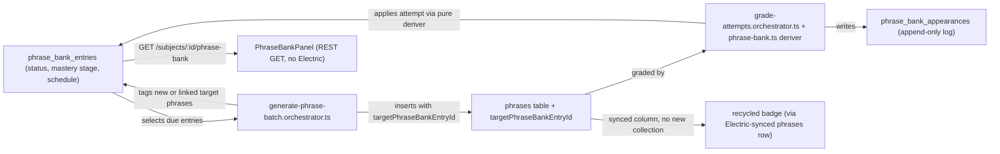

# Architecture: Phrase-bank spaced repetition with mastery tracking

## What changed

`phrases` rows used to be disposable, one-off generated-sentence instances — every batch was
fresh content with no identity surviving past a rolling "avoid repeating this Russian text" list.
This plan gives a specific *target expression* (an idiom, a vocabulary correction) real identity
that persists across many batches, accumulates attempt history, and drives whether it gets
recycled, rescued, or archived as mastered.

Two new tables (`phrase_bank_entries`, `phrase_bank_appearances`) thread through the existing
generate → grade loop rather than replacing it. Three pure functions in
`packages/core/src/phrase-bank/phrase-bank.ts` carry the actual algorithm — due-phrase selection,
the new/practicing/struggling/mastered state machine, and text-based entry matching — so the
mastery rules are unit-tested without a database or an LLM call. Neither orchestrator
(`generate-phrase-batch.orchestrator.ts`, `grade-attempts.orchestrator.ts`) re-implements these
rules; they only fetch entries, call the deriver, and persist the result.

## UI wiring (Phase 2)

The learner discovers recycling and mastery without reading the database (SCENARIO 6):

- A phrase card whose underlying `phrases` row carries a non-null `targetPhraseBankEntryId`
  renders a "Recycled" badge (`data-testid="phrase-recycled-badge"`) during a live batch. This
  rides the already-synced `phrases` Electric collection — a new column, not a new collection.
- Grading a chunk returns `phraseBankUpdates` alongside `attempts`; an entry that reaches
  `status: "mastered"` in that response is called out inline on the graded result
  (`data-testid="phrase-mastered-indicator"`), and triggers a refetch of the Phrase Bank panel.
- `PhraseBankPanel` (`data-testid="phrase-bank-panel"`) is a plain REST `GET
  /subjects/:id/phrase-bank` fetched via TanStack Query, deliberately **not** a new Electric-synced
  collection — the pipeline was already flagged as an unconfigured single point of failure
  (`docs/architecture/english-batch-practice/review.md`), and this panel doesn't need multi-tab
  real-time sync to be useful.

## New infrastructure

None. No new cloud resources, deploy pipeline, or IaC changes — this is entirely within the
existing `apps/api`/`apps/web` application boundary; the schema change is an application-level
Drizzle migration.

## Scope boundary

Out of scope for this plan: migrating the source app's real practice history, fixing the
pre-existing Electric-sync single point of failure in general, quiz-mode integration, workplace
scenario packs, and fuzzy/semantic deduplication of near-duplicate phrase-bank entries. See
`.planning/phrase-bank-mastery/spec.md`'s "Scope boundary" for the full list and reasoning.
