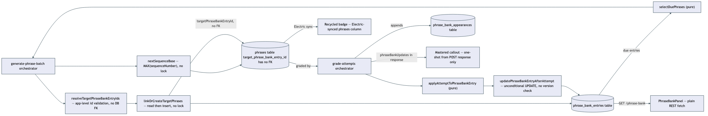
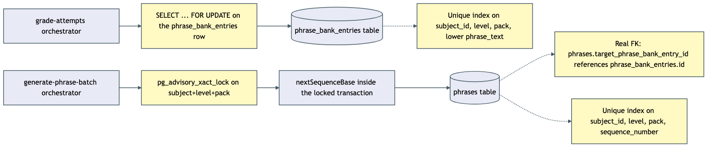

# Architecture Review: Phrase-bank spaced repetition with mastery tracking

## What was reviewed

A system that gives a target expression (an idiom, a vocabulary correction) durable identity
across many practice batches instead of treating every generated sentence as disposable: it gets
recycled into future batches while the learner is still shaky on it, and archived as "mastered"
once answered correctly three times with real separation between attempts. In scope: the pure
mastery-state derivers (`packages/core/src/phrase-bank/`), the repo/orchestrator wiring on both
the generate and grade paths, the new `GET /subjects/:id/phrase-bank` endpoint, the schema
migration, and the frontend surfacing (recycled badge, mastered callout, summary panel).

## Documentation found

`.planning/phrase-bank-mastery/spec.md` and `architecture.md` — an unusually thorough planning
record that already went through one real red-team (`/grill-plan-ie`) revision cycle, which
caught and fixed a genuinely broken adjacency-detection design before anything was built. Verified
the actual code against that document directly, not just against the code in isolation — see
Verdict for where they diverge.

## As-built architecture

Generation selects due phrases (pure `selectDuePhrases`), asks the model to recycle up to three of
them by echoing their ids, validates every echo against the actual due-set sent before trusting
it, and links or creates `phrase_bank_entries` rows accordingly. Grading runs the graded verdict
through the same pure state machine (`applyAttemptToPhraseBankEntry`) that owns the entire
new→practicing→struggling→mastered transition, then persists the result and an appearance record.
The frontend reads the recycled badge live off the already-Electric-synced `phrases` row, gets the
mastered callout as a one-shot value from the grading response itself, and fetches the summary
panel via a plain REST call — deliberately kept off the Electric pipeline, per the plan's own
documented tradeoff.

## Verdict

The mastery algorithm itself is sound and well-isolated: the entire state machine lives in one
pure, heavily-tested function that both orchestrators call rather than reimplement, exactly the
separation the plan intended, and the sentence-sequence redesign from the red-team pass correctly
prevents the adjacency bugs it was built to prevent — for a single learner working through the app
one tab at a time.

**The gap is concurrency, and it's compounded by a mismatch between the design doc and the actual
schema.** `architecture.md`'s own "Failure modes" section states plainly that
`phrases.targetPhraseBankEntryId` is "a real FK" and that this is *why* an unvalidated echo is
safe — "an unvalidated echo would otherwise crash the whole batch insert." That's not what's in
the database. The migration adds the column with no `REFERENCES` clause, and `schema.ts` declares
it as a plain `text()` field. The current code is safe anyway, because the one path that writes
this column (`resolveTargetPhraseBankEntryIds`) validates every id against the real due-set before
using it — but that safety is entirely app-level convention, not a DB-enforced invariant. Any
future write path that touches this column — a script, a migration, a different code path — has
nothing stopping it from writing a dangling reference, and nothing will complain when it does.

That absence turns three real races into silent data corruption instead of a loud, catchable
error:
- `nextSequenceBase` reads `MAX(sequenceNumber)` with no lock and no unique constraint on
  `(subject_id, level, pack, sequence_number)`. Two tabs generating a batch for the same
  subject/level/pack at the same moment can both read the same max and hand out overlapping
  sequence numbers — which corrupts the exact adjacency arithmetic the sequence-number redesign
  exists to protect, the single most carefully-reasoned part of this whole plan.
- `linkOrCreateTargetPhrases` does an unlocked read-then-insert; two concurrent requests
  introducing the same new phrase text can each miss the other's not-yet-committed row and create
  two `phrase_bank_entries` for the same expression, no unique constraint to catch it.
- `updatePhraseBankEntryAfterAttempt` is an unconditional `UPDATE` with no optimistic-concurrency
  check. Two tabs grading against the same entry concurrently can have the second write silently
  overwrite the first's mastery progression — a learner could genuinely earn "mastered" and have
  it quietly lost.

None of this throws. It just produces wrong numbers that nobody's watching for, in a table whose
entire purpose is to be a precise, trustworthy count.

**A second, smaller issue worth naming but not escalating:** grading's own phrase-bank bookkeeping
isn't wrapped in error handling. If it throws after `insertAttempts` has already committed, the
whole `POST /attempts` call fails with a 500 — the learner's answers were actually graded and
saved, but the response tells them (and the UI) it failed. A retry from that state could produce
duplicate attempt rows, since there's no idempotency key on this endpoint.

## Proposed alternative

Two additive, non-breaking migrations close the actual gap: a real FK from
`phrases.targetPhraseBankEntryId` to `phrase_bank_entries.id` (matching what the design doc
already assumed exists), a unique index on `phrases(subject_id, level, pack, sequence_number)`,
and a unique index on `phrase_bank_entries(subject_id, level, pack, lower(phrase_text))` as a
DB-level backstop to the existing app-level exact-match check. For the write paths: wrap
`nextSequenceBase` + the batch insert in a transaction guarded by
`pg_advisory_xact_lock(hashtext(subjectId || level || pack))`, and change
`updatePhraseBankEntryAfterAttempt` to a `SELECT ... FOR UPDATE` read inside the same
transaction as its write, so two concurrent grades against the same entry serialize instead of
racing. None of this changes the pure derivers or the API shape — it's entirely inside the two
repo functions and one migration.

## Questions a reviewer would ask

- Given `architecture.md` explicitly describes the id-echo column as "a real FK," was that always
  aspirational, or did the FK get dropped somewhere between planning and the generated migration —
  and if the latter, what else in this migration might have silently diverged from the plan?
- What's the expected behavior today if a learner has the practice page open in two tabs — has
  that actually been tried, or is single-tab the only path anyone's exercised?
- Why does `applyPhraseBankUpdates` run outside a try/catch when `phrase_bank_entry_not_found` (a
  very similar failure) is explicitly handled gracefully one layer down — was the outer omission
  deliberate or an oversight?
- Is a duplicate `phrase_bank_entries` row for the same expression (from the unlocked
  read-then-insert race) something the mastery math tolerates gracefully, or does it silently
  halve a learner's real progress toward mastering that phrase by splitting their correct answers
  across two entries?
- The Phrase Bank panel is a plain fetch with no live refresh — does it get invalidated when a
  grading call returns `phraseBankUpdates`, or does a learner need to navigate away and back to
  see their own just-updated bank state reflected there?

For the business-stakeholder Q&A that closes the BMAD cycle, run /debrief-qa.
