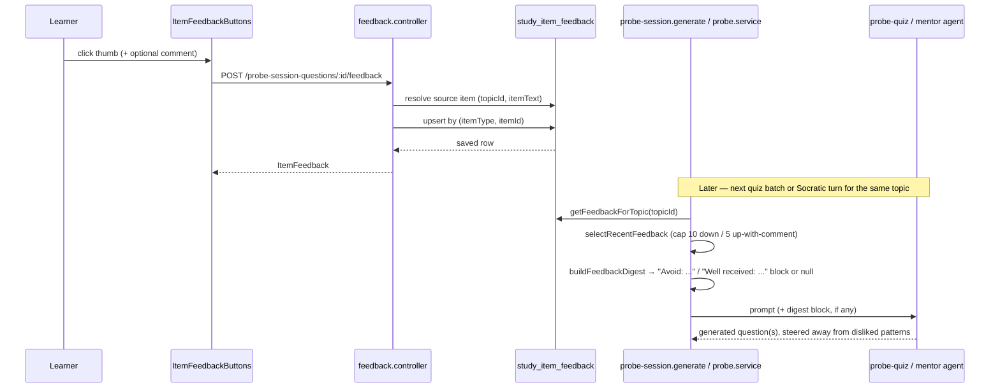
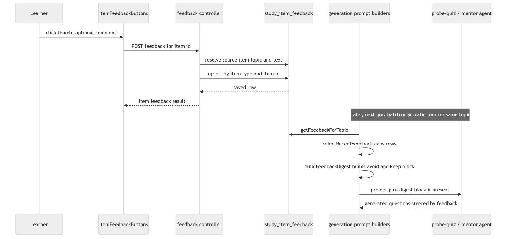

# Architecture: Question feedback memory

## What changes structurally

**No new services, no new async boundary.** One new small entity module in `apps/api` (`feedback/`, mirroring the existing `gap/` module's shape — `feedback.repo.ts` + `feedback.controller.ts`, no `service.ts` needed since there's no multi-step orchestration), one new table, one new pure deriver in `packages/core`, and two existing prompt-assembly functions gain one extra optional block each.

**One feedback table for both item kinds, not two.** `probe_session_questions` and `socratic_turns` are different tables with different owners (`topic-study-experience`, mid-implementation in parallel, owns both). Rather than add a feedback table per source table (duplicating the same rating/comment/date shape twice) or a real FK (impossible cleanly across two tables without a discriminated-union constraint Postgres doesn't support well), `study_item_feedback` is a single polymorphic table keyed by `(itemType, itemId)`, with referential integrity enforced at the application layer (the write path validates the referenced row exists before inserting) rather than a DB-level FK. This is a deliberate, logged trade-off, acceptable because this is a personal single-user app with no concurrent-write risk and low row volume.

**Feedback digest retrieval and generation-prompt injection are separate, composable pieces — no new agent.** A pure deriver (`buildFeedbackDigest`, `packages/core/src/feedback/feedback-digest.ts`) takes already-retrieved, already-capped rows and formats them into a short "keep" / "avoid" block, or returns `null` when there's nothing to say. The two existing prompt-builder functions — `topicBlock()` in `probe-session.generate.ts` and `generateQuestion()` in `probe.service.ts` — each call the same repo retrieval + deriver pair and splice the result into their existing `.filter(Boolean).join("\n")` prompt assembly, exactly the pattern both functions already use for optional blocks (grounding text, gap lists). No agent's `Agent` constructor changes shape; only their `INSTRUCTIONS` strings gain one rule about respecting an avoid/keep list when one is present in the prompt.

**No LLM call anywhere in the feedback path — submission or retrieval.** The task's "what needs to be corrected" is satisfied by treating the user's own comment as already being the correction note (a thumbs-down popover is a one-line quick reaction, not an essay needing summarization) and packaging it as an "Avoid: <comment>" bullet at digest-build time. See "Resolving the summarization fork" below.

## Resolving the summarization fork

The task asked: does "what needs to be corrected" require an LLM call at submission time, or can it be deferred to generation-time retrieval? Decision: **deferred, and no LLM call is needed at either point** — a third option the original framing left open.

- **Rejected: LLM call at submission time.** Adds latency to a UI action that should feel instant (a thumbs click), adds a new agent/prompt to maintain, and costs money on every single feedback event — for a personal app where feedback volume is a handful of items a week, this is pure overhead with no realized benefit.
- **Rejected: a persisted `correction` column distinct from `comment`.** If both would hold identical text in the common case, a separate column is redundant storage with no independent value today.
- **Chosen: `comment` is the only free-text field stored; "what needs to be corrected" is a *view* the digest deriver produces from `(rating: down, comment)` at prompt-build time.** `buildFeedbackDigest` renders `down` rows with a comment as `- Avoid: <comment>` and `down` rows without a comment as `- Disliked, no reason given: "<itemText, truncated>"` — still a real signal without inventing a reason. `up` rows with a comment render as `- Well received: <comment>`; `up` rows without a comment are dropped entirely since there's no text to act on.

This keeps the whole feedback loop **deterministic and unit-testable** (the deriver has no LLM dependency) rather than adding a second, harder-to-test LLM call whose output would itself need review.

## New infrastructure

None.

## Data model evolution

One new table, Drizzle-generated migration (`apps/api/src/db/migrations/0011_shocking_iron_man.sql`):

```
study_item_feedback
  id            text PK
  item_type     text NOT NULL         -- 'probe_question' | 'socratic_turn'
  item_id       text NOT NULL         -- probe_session_questions.id or socratic_turns.id (app-enforced, no DB FK — polymorphic)
  topic_id      text NULLABLE         -- denormalized from the item at write time; null only for module-scope
                                       -- integrative quiz questions; socratic_turns always have one via
                                       -- their session, so turn feedback's topic_id is never null
  item_text     text NOT NULL         -- snapshot of the question prompt / turn prompt at feedback time
  rating        text NOT NULL         -- 'up' | 'down'
  comment       text NULLABLE         -- app-level cap of 500 chars, enforced by the Zod input schema
  created_at    timestamptz NOT NULL default now()
  updated_at    timestamptz NOT NULL default now()

  UNIQUE (item_type, item_id)
```

No changes to `probe_session_questions`, `socratic_turns`, or any other existing table — purely additive.

## Flow





## Failure modes

- **Feedback submitted for an item that doesn't exist (bad id, race with session cleanup).** The write path looks up the source row (`probe_session_questions` or `socratic_turns` by id) before inserting, to capture `topicId`/`itemText`; if the lookup misses, the request 404s rather than inserting an orphaned row with fabricated text.
- **Module-scope quiz feedback with `topic_id: null`.** Stored (the vote itself is still meaningful data), but excluded from the per-topic digest query — a null-scope row can never match a topic-scoped `WHERE topic_id = ?`. Not surfaced in any generation prompt in this plan. Accepted scope cut, not a bug.
- **Digest growth over a long-lived topic.** Capped at the 10 most recent `down` + 5 most recent `up`-with-comment rows — a simple recency window, not a decay/ranking algorithm.
- **Same item rated twice in rapid succession (double-click, network retry).** The unique `(item_type, item_id)` constraint makes the write idempotent — a second submission for the same item updates the existing row rather than erroring or duplicating.

## Rollout

Single deploy, no feature flag — feedback is purely additive UI (new thumbs buttons) and purely additive prompt content (both prompt builders already tolerate empty optional sections). Apply the generated migration before deploying the API build that reads/writes `study_item_feedback`.
