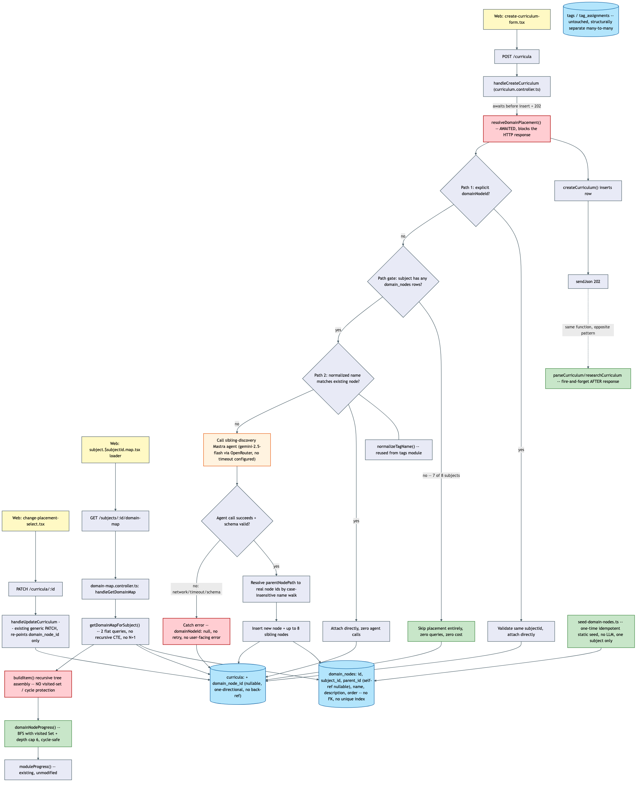

# Architecture Review: seed-knowledge-map

## What was reviewed

A new self-referential `domain_nodes` tree per subject that sits between `subjects` and
`curricula`, reflecting the real shape of a technical domain independent of what's actually been
studied. Curricula are placed into this tree at creation time via one of three paths (explicit
node, silent normalized-name match, or an LLM "sibling discovery" agent), and a new
`/subject/:id/map` page visualizes the tree with a per-node knowledge-percentage rollup computed
from real stored topic progress. In scope: `packages/core/src/domain-map/domain-map-progress.ts`,
`apps/api/src/domain-map/*`, `apps/api/src/mastra/sibling-discovery.agent.ts`, the `domain_nodes`
schema/migration, `apps/web/src/domain-map/*`, and the new map route. Reviewed against merge
commit `5cc2c95` (parent `f036fcc`, feature commit `6454d4f`), diffed directly.

## Documentation found

Full plan-backed documentation already existed and was treated as the review-equivalent build
record, per this run's convention: `.planning/seed-knowledge-map/spec.md`, `architecture.md`,
`scenarios.md`, `playwright.md`, `state-fixtures.md` (all `state: confirmed`), plus
`.planning/LOG.md`'s 06:35 entry describing the build, a real frontend race found and fixed, a
pre-existing vitest-config gap fixed, and a genuine live-LLM verification the build agent ran
against the seeded tree before merging. The code matches the documented design closely — no
drift found between `architecture.md`/`spec.md` and what's actually merged.

## As-built architecture

Three entry points: `POST /curricula` (create, routes through placement), `PATCH /curricula/:id`
(re-point placement, reuses the existing generic update endpoint), and `GET
/subjects/:id/domain-map` (read-only tree + percentages, SSR loader). On the write side,
`handleCreateCurriculum` awaits `resolveDomainPlacement()` before inserting the curriculum row and
sending the response — the three-path decision (explicit → silent match → sibling-discovery
agent) runs synchronously on the request. The agent call (path 3) is gated behind two free checks
(subject has a tree at all; no normalized-name match) so it fires only for genuinely ambiguous
names on the one gated subject. Any agent failure is caught and falls back to `domainNodeId: null`,
identical to today's unplaced behavior, no retry, no surfaced error. On the read side,
`getDomainMapForSubject` runs two flat queries (never a recursive CTE, never N+1), assembles the
tree in memory via `buildItem()`, and calls `domainNodeProgress()` once per node — a BFS with a
visited-set and a depth cap of 6 that delegates to the existing, unmodified `moduleProgress()`.
`domain_nodes` and `curricula.domain_node_id` are additive, no-FK columns matching this schema's
existing convention; `tags`/`tagAssignments` are untouched.

## Verdict

Sound. This is a well-reasoned design that earns its own `architecture.md` and follows this
codebase's established conventions (no-FK plain columns, try/catch-fallback around agent calls,
name-not-id contracts for structured LLM output, cost-gating before any new LLM call). Two real,
named tradeoffs, neither of which crosses the escalation bar (no data loss, no security exposure,
no outage/runaway-cost path, no SPOF, nothing blocking near-term planned work):

1. **The sibling-discovery agent call blocks the HTTP response.** `resolveDomainPlacement()` is
   `await`-ed inside `handleCreateCurriculum` before the curriculum row is inserted and before the
   202 is sent — a synchronous dependency on an external LLM call sitting directly on the
   curriculum-creation critical path. This is a real departure from the same function's own
   pattern two lines later, where `parseCurriculum`/`researchCurriculum` are explicitly
   fire-and-forget *after* the response is already sent. In practice the exposure is bounded: it
   only fires for the one gated subject, only on genuinely unmatched names, there's no timeout
   configured on the agent call anywhere in this codebase (so this isn't a new gap this feature
   introduced — it's the existing house style, applied consistently), and a slow/hung call degrades
   to "the user waits longer for their curriculum to appear," not data loss or a stuck system. Worth
   asking about (see below), not worth blocking on.
2. **The read-path tree assembly (`buildItem()` in `domain-map.repo.ts`) has no cycle protection**,
   while the percentage deriver it calls (`domainNodeProgress()`) explicitly does — a visited Set
   plus a depth cap of 6, called out in `spec.md` as a defensive bound against future misuse. v1
   genuinely cannot create a cycle (no re-parenting endpoint exists yet; that's explicitly issue
   #56, the next item in the queue), so there's no live path to trigger this today. But the
   asymmetry is real: if issue #56 ever lands a re-parenting bug, or a cycle is introduced by hand
   (migration, script, manual fix), `buildItem()`'s unbounded recursion would crash the one request
   building the tree, while the deriver right next to it would have quietly survived the same bad
   data. This is a pre-existing-style gap worth closing cheaply (mirror the same visited-set guard)
   before issue #56 adds a write path that could actually produce a cycle.

The deliberate separation from `tags`/`tagAssignments` is architecturally sound, not confusing
overlap. Tags are many-to-many cross-cutting labels (a node can carry several, a label can span
unrelated branches); `domain_nodes` needs the opposite invariant — exactly one parent per node,
which the entire placement/rollup mechanism depends on. Folding this into the tag model would have
required either giving up the one-parent invariant or bolting on a discriminator column that every
future tag-suggestion feature would have to special-case. The two mechanisms don't overlap in
practice either: `resolveDomainPlacement()` reuses `normalizeTagName()` — a plain string utility,
not the tag data model — for name comparison, which is exactly the right level of code reuse
without conflating the two concepts.

## Questions a reviewer would ask

1. Why is `resolveDomainPlacement()` awaited before the response, when every other side effect in
   `handleCreateCurriculum` (parse, research) is dispatched fire-and-forget after the 202? Was this
   a deliberate choice (the client needs `domainNodeId` in the initial response) or an oversight?
2. `buildItem()` in `domain-map.repo.ts` recurses over `domain_nodes` with no visited-set guard,
   unlike `domainNodeProgress()` right next to it. Is there a plan to add the same guard before
   issue #56 introduces a write path (re-parenting) that could actually produce a cycle?
3. There's no unique index on `domain_nodes (subject_id, parent_id, name)`. If two curriculum
   creations for the same unmatched topic name race (two tabs, a retry), could both independently
   miss the silent-match check and each call the sibling-discovery agent, producing two near-duplicate
   nodes for the same topic? Is that an accepted v1 gap or worth a unique constraint now?
4. The sibling-discovery agent has no timeout configured, matching every other agent in this
   codebase. Given this one sits synchronously in front of a user-facing create action rather than
   an async background job, does it deserve a shorter timeout than the rest, or is the existing
   fallback-on-any-error behavior considered sufficient regardless of how long "any error" takes to
   arrive?
5. `resolveParentNodePath()` falls back to "last successfully resolved ancestor" when the agent
   names an unrecognized deeper segment. Was a case considered where the agent hallucinates a
   *shallow* segment correctly but a *deep* one wrong — does the fallback still land somewhere
   sensible, or could it silently attach a topic much higher in the tree than intended?
6. `domain_nodes` has no index on `subject_id` or `parent_id` even though both are the predicate for
   every read query and every recursive lookup. Is this deferred until real subject/tree sizes
   justify it, or worth adding now while the migration is fresh?
7. The seed script only covers "Programming / Web Development." When a second subject eventually
   gets a tree (manually or via a future seed), does the placement/gating logic need any change, or
   is `existingNodes.length === 0` genuinely sufficient as the only gate forever?
8. `siblingSuggestions` creates up to 8 sibling nodes with no curriculum attached, purely
   informational. Is there any UI/data signal distinguishing "a node someone actually placed a
   curriculum under" from "a node the LLM guessed exists in the ecosystem," or do they render
   identically in the tree?
