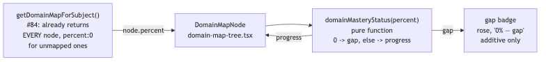

# Architecture Review: separate-progress-overlay-from-structure

## What was reviewed

A small, purely additive change locking in and surfacing a property #84 already established: the
domain map already returns every taxonomy node regardless of curriculum coverage. This ticket adds
a visible "gap" badge for nodes at 0% mastery and a regression test proving the always-shown
property holds against the real rollup, not just a stub. 5 files touched (1 modified, 4 new).

## Documentation found

None specific to this ticket existed yet — reconstructed from the code and the plan
(`.planning/separate-progress-overlay-from-structure/spec.md`), which itself documents accurately
that the "always shown" requirement was already satisfied by #84 and this ticket's real job is
narrower than the wishlist item's own wording implied.

## As-built architecture

`domainMasteryStatus(percent)` is a pure function (`packages/core/src/domain-map/`) with exactly
two outcomes, `"gap"` at `percent === 0` and `"progress"` otherwise. `DomainMapNode` calls it and
conditionally renders one additional badge span — nothing else in the existing render path changed.

## Verdict

**Sound**, and notably minimal for what it needed to be. The real engineering judgment here was in
planning, not building: recognizing that half the wishlist item's stated requirement was already
done by #84, and scoping this ticket to only the genuinely missing piece (the visual signal) rather
than re-implementing something that already worked. The implementation matches that scope exactly —
one pure function, one additive UI element, tests that exercise the real rollup rather than a mock.

No tradeoffs worth naming — this is about as low-risk as a UI change gets: no new state, no new
data flow, no write path touched at all.

## Questions a reviewer would ask

1. `domainMasteryStatus` currently has only two states (gap/progress) — is a third state ever
   anticipated (e.g. "stale"/"unverified," which `.product/PRINCIPLES.md` mentions for 90-day-old
   concepts) that would need this function's shape to grow, or is gap/progress genuinely the
   complete taxonomy of states this map will ever need?
2. The gap badge is purely visual (a rose span) — the wishlist's own "Done when" also says gaps
   must be "actionable," but this ticket's fork-classifier resolved "actionable mechanism" to a
   safe default. What was that default, and does clicking the badge (or anything near it) actually
   do something today, or is "actionable" deferred to a later ticket?
3. This ticket found the shared local dev Postgres container had schema drift from another
   in-progress worktree silently skipping this branch's migration (Drizzle gates by `created_at`
   comparison, not per-migration hash) — is that a one-off collision from tonight's unusually high
   worktree concurrency, or a standing risk any two concurrent worktrees sharing that container
   could hit again?
