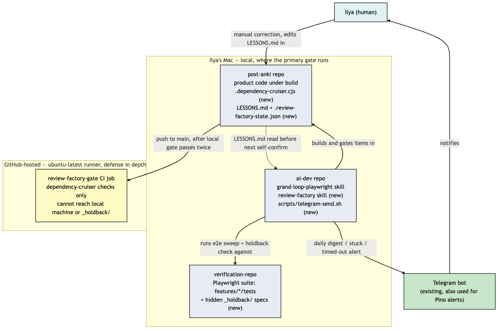
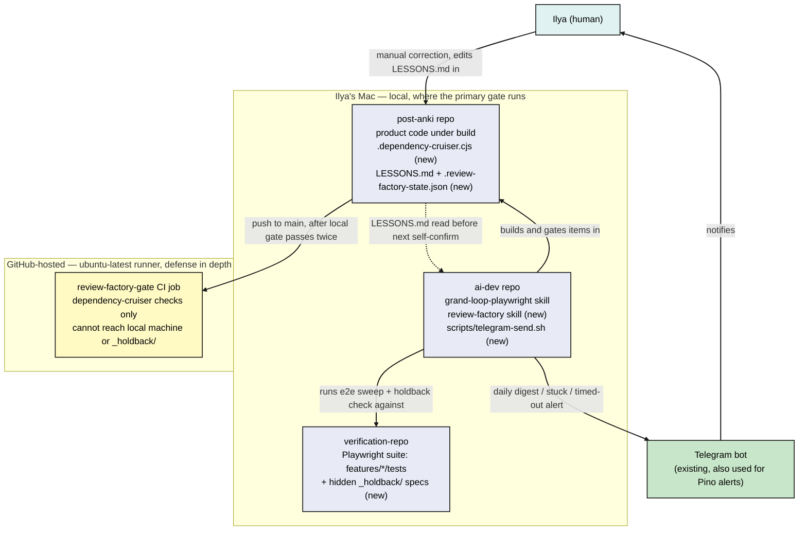
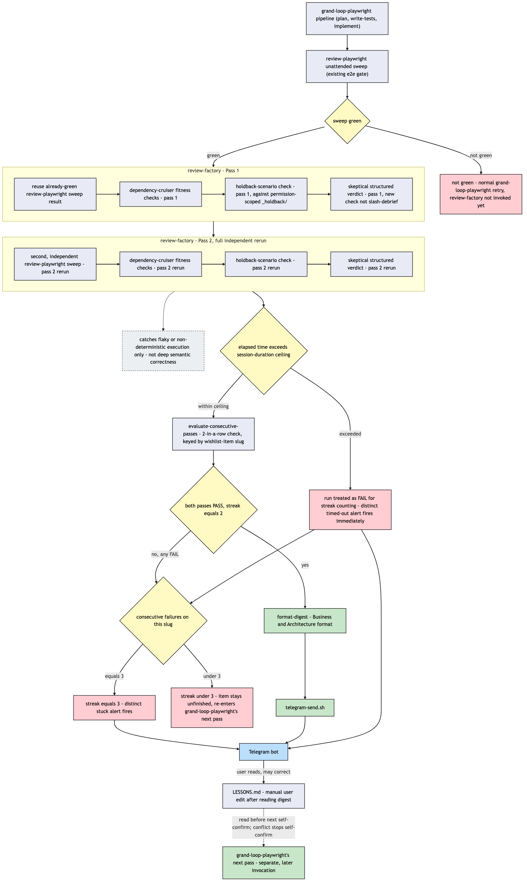
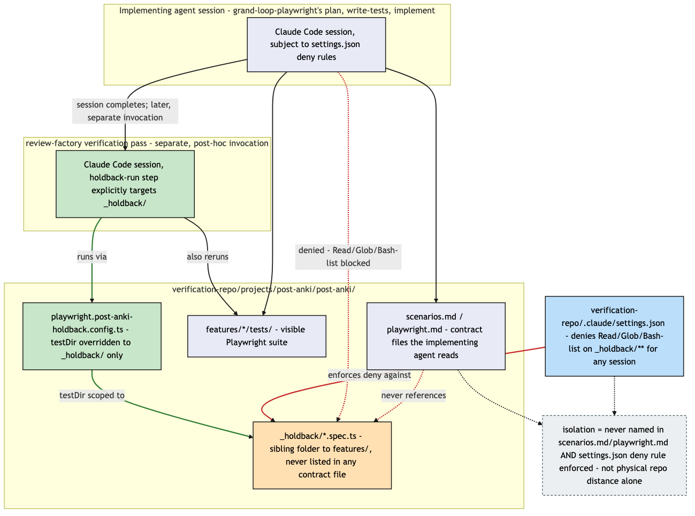
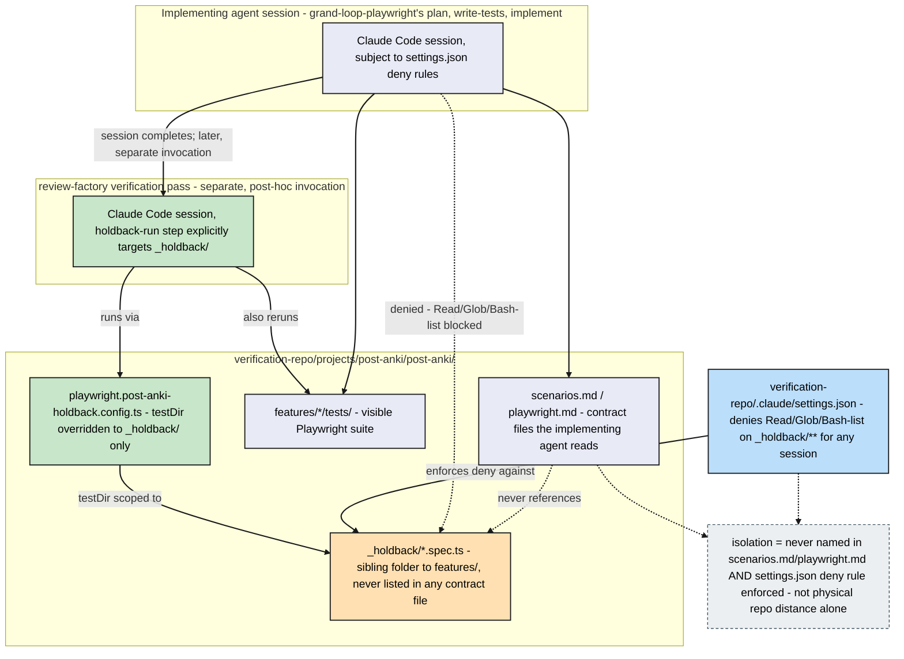

# Architecture: Software factory review gate (Phase 0)

**Status note (read this first):** this document describes the gate as designed and confirmed in
`ai-dev/.planning/unassigned/software-factory/spec.md`, `scenarios.md`, and `architecture.md`. Six
of the seven pieces it depends on are built and independently verified (fitness functions, the
holdback isolation boundary, the four pure derivers, the Telegram sender, the `LESSONS.md` read
step, this diagram set). The orchestrating skill that wires them together end-to-end
(`review-factory`) is still being implemented as of this writing — everything below describes the
target design that skill is being built against, not yet an observed live run. The plan itself is
still `state: draft`, not `state: confirmed` — that flip is a human decision, not an automated one.

## Why this exists

Before this phase, "done" for a post-anki change meant: the existing Playwright e2e suite is green,
plus an occasional `/debrief` architecture check. That is not a strong enough guarantee for a
project nobody reads the diff on — an agent can make its own tests pass without the underlying
behavior being correct, and a single green run proves the harness ran once, not that it's stable.
This gate closes both gaps with a second, independent verification layer that never touches the
diff itself, plus a two-in-a-row consistency requirement before anything is called finished.

## System context

Three repositories and one external channel are involved, only one of which — the human's Mac —
runs the primary gate. GitHub is a backstop, not the enforcement point, because a GitHub-hosted
runner cannot reach the parts of this design that depend on being run locally.

**Why the split.** `ai-dev` owns the orchestration (the skills and scripts that decide when a gate
runs and what happens with the result); `post-anki` owns the product code being gated, plus the
harness's own small amount of state (`LESSONS.md`, a run-history file); `verification-repo` owns
every e2e scenario, visible and hidden. GitHub CI only ever sees what a hosted runner can reach —
which excludes the human's Mac entirely, so it re-checks one static rule (dependency-cruiser) and
nothing that depends on local process control or a locally-denied filesystem path.

## The local gate — full walkthrough

This is the primary, blocking enforcement point. Nothing about a change counts as done until it
clears this gate twice in a row.

```mermaid
flowchart TD
  classDef default fill:#e8eaf6,stroke:#1a1a1a,stroke-width:1.5px,color:#000
  classDef passPath fill:#c8e6c9,stroke:#1a1a1a,stroke-width:1.5px,color:#000
  classDef failPath fill:#ffcdd2,stroke:#1a1a1a,stroke-width:1.5px,color:#000
  classDef decision fill:#fff9c4,stroke:#1a1a1a,stroke-width:1.5px,color:#000
  classDef noteNode fill:#eceff1,stroke:#455a64,stroke-width:1.2px,color:#000,stroke-dasharray: 4 3
  classDef telegramNode fill:#bbdefb,stroke:#1a1a1a,stroke-width:1.5px,color:#000
  linkStyle default stroke:#1a1a1a,stroke-width:1.8px

  GLP["grand-loop-playwright pipeline (plan, write-tests, implement)"]
  SWEEP1["review-playwright unattended sweep (existing e2e gate)"]
  DSWEEP{sweep green}
  BACKLOOP["not green - normal grand-loop-playwright retry, review-factory not invoked yet"]

  subgraph PASS1["review-factory - Pass 1"]
    direction LR
    P1_REUSE["reuse already-green review-playwright sweep result"]
    P1_DC["dependency-cruiser fitness checks - pass 1"]
    P1_HOLD["holdback-scenario check - pass 1, against permission-scoped _holdback/"]
    P1_VERDICT["skeptical structured verdict - pass 1, new check not slash-debrief"]
    P1_REUSE --> P1_DC --> P1_HOLD --> P1_VERDICT
  end

  subgraph PASS2["review-factory - Pass 2, full independent rerun"]
    direction LR
    P2_SWEEP["second, independent review-playwright sweep - pass 2 rerun"]
    P2_DC["dependency-cruiser fitness checks - pass 2 rerun"]
    P2_HOLD["holdback-scenario check - pass 2 rerun"]
    P2_VERDICT["skeptical structured verdict - pass 2 rerun"]
    P2_SWEEP --> P2_DC --> P2_HOLD --> P2_VERDICT
  end

  NOTE2["catches flaky or non-deterministic execution only - not deep semantic correctness"]
  DUR{elapsed time exceeds session-duration ceiling}
  TIMEOUT["run treated as FAIL for streak counting - distinct timed-out alert fires immediately"]
  ECP["evaluate-consecutive-passes - 2-in-a-row check, keyed by wishlist-item slug"]
  DSTREAK{both passes PASS, streak equals 2}
  DIGEST["format-digest - Business and Architecture format"]
  SEND["telegram-send.sh"]
  TELEGRAM["Telegram bot"]
  LESSONSEDIT["LESSONS.md - manual user edit after reading digest"]
  DFAIL{consecutive failures on this slug}
  RETRY["streak under 3 - item stays unfinished, re-enters grand-loop-playwright's next pass"]
  STRIKE["streak equals 3 - distinct stuck alert fires"]
  NEXTLOOP["grand-loop-playwright's next pass - separate, later invocation"]

  GLP --> SWEEP1
  SWEEP1 --> DSWEEP
  DSWEEP -->|not green| BACKLOOP
  DSWEEP -->|green| P1_REUSE
  P1_VERDICT --> P2_SWEEP
  PASS2 -.-> NOTE2
  P2_VERDICT --> DUR
  DUR -->|exceeded| TIMEOUT
  DUR -->|within ceiling| ECP
  TIMEOUT --> DFAIL
  TIMEOUT --> TELEGRAM
  ECP --> DSTREAK
  DSTREAK -->|yes| DIGEST
  DSTREAK -->|no, any FAIL| DFAIL
  DFAIL -->|under 3| RETRY
  DFAIL -->|equals 3| STRIKE
  DIGEST --> SEND
  SEND --> TELEGRAM
  STRIKE --> TELEGRAM
  TELEGRAM -->|"user reads, may correct"| LESSONSEDIT
  LESSONSEDIT -.->|"read before next self-confirm; conflict stops self-confirm"| NEXTLOOP

  class DSWEEP,DUR,DSTREAK,DFAIL decision
  class BACKLOOP,RETRY failPath
  class TIMEOUT,STRIKE failPath
  class DIGEST,SEND passPath
  class NOTE2 noteNode
  class TELEGRAM telegramNode
  class NEXTLOOP passPath
```

**Narrative walkthrough:**

1. `grand-loop-playwright` builds a wishlist item as it always has (plan, write tests, implement),
   then runs its own existing `review-playwright` e2e sweep. If that sweep isn't green, nothing
   about this gate is invoked yet — that's still the pre-existing retry loop.
2. Once the sweep is green, **Pass 1** starts: it reuses that already-green sweep result (no need
   to re-run it a third time in the same minute), then runs the dependency-cruiser fitness checks,
   then the holdback-scenario check against the permission-scoped `_holdback/` folder, then a new
   skeptical structured verdict (four dimensions — correctness, security, tests, architecture —
   see "The structured verdict" below).
3. **Pass 2** is a fully independent repeat of all four checks, including a *second*,
   freshly-run `review-playwright` sweep — not a reuse. This is the piece that catches
   flakiness: a change that only passes some of the time will eventually show that on one of the
   two required runs. It is explicitly not proof of deeper correctness across different inputs;
   the digest logic must never claim more than that.
4. Elapsed wall-clock time since Pass 1 started is checked against a session-duration ceiling
   before anything else happens. If exceeded, the run is treated as a normal FAIL for
   streak-counting purposes and a distinct "timed out" alert fires immediately — this catches a
   hung sub-process or a stall nothing else in the stack would notice, since nothing else here is
   watching the clock.
5. If both passes are clean and the streak for this specific wishlist-item slug reaches 2, a
   digest is generated and sent. Any failure anywhere resets the streak to zero for that slug — two
   passes with a failure in between do not count as "2 out of the last N."
6. Three consecutive failures on the same slug stop the retry loop and send a distinct "stuck"
   alert instead — see "Two escalation paths, not one" below.

## The structured verdict

A new, separately-prompted check — not a reuse of the existing `/debrief` skill, and not merged
into its invocation. `/debrief` is calibrated for "is this a sound architecture," run once per
finished unit; this check is calibrated for "does this specific change hold up under an
adversarial read," run inside the gate itself, before anything is called done. Reusing `/debrief`
directly would have meant either running it twice per item for two different purposes, or
softening its existing calibration to serve both — both worse than a second, purpose-built check.
It always reports all four dimensions explicitly, even when one is trivially not applicable to a
given change (an explicit "N/A: `<reason>`", never a silent omission), and a FAIL on any single
dimension is enough to fail the whole pass, regardless of the other three.

## Holdback isolation — how "the agent can't see this" is actually enforced

The core anti-overfitting mechanism: a set of e2e scenarios that verify real behavior, kept
genuinely invisible to the same agent session that implements the change being checked.

**Two properties, both required — neither alone is isolation.** `_holdback/` sits as a sibling
folder to `features/`, physically inside the same repo, on purpose: distance from post-anki was
never the actual risk, since the implementing agent needs `verification-repo` access anyway for
the rest of its own pipeline. What makes the isolation real is (a) `_holdback/` is never
referenced by any `scenarios.md`/`playwright.md` file the implementing agent's contract points it
at, so there's no reason for it to go looking, and (b)
`verification-repo/.claude/settings.json` hard-denies Read/Glob/Bash-list access to
`_holdback/**` for any session, so even a curious or exploratory read attempt is refused, not just
undocumented. The `review-factory` verification pass, run later as a separate invocation with a
dedicated Playwright config scoped only to `_holdback/`, is a different Claude Code session
entirely — not a continuation of the implementing session with different instructions.

## Two escalation paths, not one

Two distinct failure signatures exist and are deliberately kept visually and textually distinct in
their Telegram alerts, so a glance at the phone tells you which one you're looking at:

| Signature | Trigger | What it means | Alert wording |
|---|---|---|---|
| **Stuck** | 3 consecutive gate failures on the same wishlist-item slug | The item keeps failing outright — a fitness rule it can't satisfy, a holdback scenario it can't pass, or a verdict that keeps failing | "stuck" |
| **Timed out** | Elapsed wall-clock time from the start of Pass 1 exceeds a configured ceiling | A single run never concluded either way — a hung sub-process, a stall nothing else here catches | "timed out" |

Both share the same Telegram channel (the existing bot already used for Pino error/fatal alerts —
no new channel introduced), but never share wording, because "this keeps failing" and "this never
finished" call for different responses from the human reading it. The session-duration ceiling
itself ships as an explicit, generous placeholder — not a number derived from real run data, since
none existed yet when this was designed — and is tracked in `todo.md` as a follow-up to tighten
once a real Phase 0 run reports an actual duration.

Both paths stop `grand-loop-playwright`'s normal resume-until-done retry behavior for that specific
item — it moves on to the next wishlist item rather than spinning on the same one indefinitely.

## The feedback loop — LESSONS.md

The only mechanism in this phase for a human correction to compound forward. There is no
Telegram-reply pipeline in Phase 0 — the loop is: digest arrives → human reads it → if a
correction is needed, the human manually edits `<project-root>/LESSONS.md` → the *next*
`grand-loop-playwright` pass on that project reads that file before self-confirming its own draft
plan. A plan that would conflict with a recorded lesson does not get silently overridden — the
self-confirm step stops instead, and that one item falls back to normal human review rather than
being auto-confirmed. A project with no `LESSONS.md` present behaves exactly as it always did —
this is a strictly additive, opt-in-by-existence mechanism, not a new required file.

## CI backstop — what it does and doesn't cover

A second, much narrower check runs in `post-anki/.github/workflows/deploy.yml` after push, gating
the `deploy`/`deploy-api`/`deploy-web` jobs. It runs only dependency-cruiser — the one check in
this whole design that a GitHub-hosted `ubuntu-latest` runner can actually perform, since it has no
access to the human's Mac, no way to run the two-pass streak logic, and no way to reach
`verification-repo`'s locally-denied `_holdback/` path. It exists as defense-in-depth against a
change reaching `main` some other way (a manual push, a merge that bypassed the local gate) — it
is not, and cannot be, the primary enforcement mechanism this design relies on.

## Component ownership

| Piece | Lives in | Owns |
|---|---|---|
| `grand-loop-playwright` skill | `ai-dev` | The existing build pipeline (plan/write-tests/implement) plus the one new step: reading `LESSONS.md` before self-confirming |
| `review-factory` skill | `ai-dev` | Orchestrates the local gate — both passes, the ceiling check, the streak check, the digest, the escalation alerts. Parameterized by project path, not hardcoded to post-anki, so a later phase can point it at a second project unmodified |
| Four pure derivers (`evaluate-consecutive-passes`, `format-digest`, `apply-lesson-precedence`, `check-session-duration-ceiling`) | `ai-dev`, `packages/review-factory` | The decision logic `review-factory` calls into — no I/O, independently unit-tested |
| `scripts/telegram-send.sh` | `ai-dev` | The one delivery path for every alert this gate produces (digest, stuck, timed out) |
| `.dependency-cruiser.cjs` | `post-anki` | The fitness-function rules, run both locally and in CI |
| `LESSONS.md`, `.review-factory-state.json` | `post-anki` | Harness process state — not product data, gitignored where noted in `spec.md` |
| Visible Playwright suite (`features/*/tests`) | `verification-repo` | What the implementing agent's own `review-playwright` sweep runs against, both passes |
| Holdback suite (`_holdback/*.spec.ts`) | `verification-repo` | The agent-blind verification layer — see isolation section above |
| `review-factory-gate` CI job | `post-anki/.github/workflows/deploy.yml` | The CI backstop — dependency-cruiser only |

## Known limitations (carried from the design, not yet contradicted by a live run)

- **Fitness-function false positives** will happen — a legitimate change tripping a rule that's
  too strict. The gate blocks correctly per this phase's own "blocking, not advisory" choice; the
  fix is tuning the rule, not bypassing the gate. Some tuning churn is expected in the first
  couple of weeks.
- **Holdback spec drift** — if post-anki's real behavior legitimately changes in a way that should
  change what a holdback scenario expects, that spec can't be updated by the same pass that changed
  the behavior, since it's permission-denied to that session. Resolving it is an explicit, separate,
  manual step — never automated inside a `grand-loop-playwright` pass. This is intended friction,
  not a bug to fix later.
- **The harness itself can flake** — a genuinely flaky e2e or holdback test could fail a good
  change, or, worse, coincidentally pass a bad one on both required runs. The two-pass requirement
  narrows this risk; it does not eliminate it. A test found to be flaky is a bug in that test, the
  same as it would be without this gate.
- **`LESSONS.md` can grow unbounded** over time, the same compliance-decay risk flagged in general
  research on rule files that keep accumulating. Not solved in this phase — flagged as a pruning or
  summarization concern for a later phase, once real entries exist to reason about.
- **Bash-tool scope has a known, disclosed gap** (found during F2's verification): obfuscated
  file-read attempts issued through a general-purpose interpreter rather than a direct file-read
  tool call are not caught by Claude Code's built-in sandbox's file-read detection — they fall
  through to a normal Bash approval prompt instead of a hard deny. In unattended/headless mode with
  nobody to approve, the command simply doesn't run, so this is safe by inaction under the
  permission mode this gate currently runs under — but it is not a hard block, and would need
  revisiting before running under any broader auto-approve permission mode.
