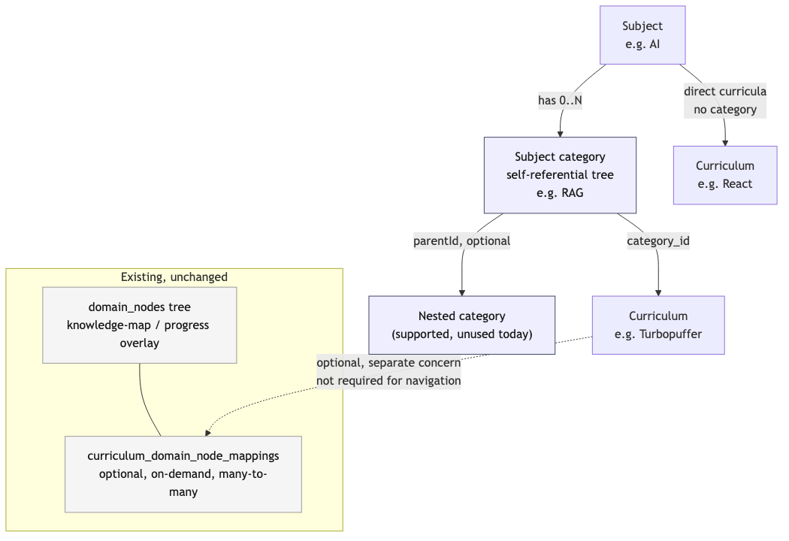

# Subject > category > curriculum nesting

## What this is

A category is an optional grouping level between a subject and its curricula, so a subject can be
organized like `AI -> RAG -> Turbopuffer` or `Programming / Web Development -> Web Theory ->
Storage`, while a curriculum with no category keeps working exactly as every curriculum did before
this existed. It is a second, self-referential tree, entirely separate from the tree this system
already has for knowledge-map/progress tracking (`domain_nodes` /
`curriculum_domain_node_mappings`) — that tree was deliberately decoupled from curricula earlier so
a curriculum's existence and placement never depend on its AI-suggestion/review/target-depth
machinery. Reusing it for a simple organizational folder would drag that machinery back in, so the
category tree carries none of it: no AI suggestion step, no review workflow, no depth/priority
tracking — just a name and a position.

## Data model

A `subject_categories` table holds one row per category: which subject it belongs to, which
category (if any) is its parent (`parentId`, nullable — null means a direct child of the subject),
and a name. Nesting is structurally unlimited — a category can sit under another category — but
real usage today is one level deep; the UI and seed data reflect that without the schema forbidding
a second level later. Neither this table nor `curricula.categoryId` carries a `.references()`
foreign key, matching this schema's dominant plain-text-column + app-level-validation convention —
cross-subject integrity is enforced by `validateCategoryBelongsToSubject`
(`packages/core/src/subject-category/`), not the database.

`curricula` gains a nullable `categoryId`. Unset means "directly under the subject" — a real,
permanent state, not a placeholder waiting to be filled in; every curriculum that predates this
column simply stays in that state until someone (or the seed data) assigns one.

## How placement is written

Creating a curriculum or a category takes an explicit target position from a tree-position picker
(scoped to one subject's own tree) and validates it server-side before writing — a category naming
a subject that doesn't exist, or a curriculum naming a category from a different subject, is
rejected outright with nothing written.

Moving a curriculum between subjects and assigning/reassigning its category are folded into one
action (`moveCurriculumToSubject`, extended with an optional `targetCategoryId`): changing a
curriculum's subject and its category together can never leave it in a state where the two
disagree — a category from the old subject surviving a subject change, or vice versa. Reassigning
only the category, with the subject unchanged, is also a legitimate use of the same action, and the
two lock ids being equal is a legitimate case here (not one to reject the way the cross-subject
merge lock's self-merge guard would). Which subject the curriculum currently belongs to isn't known
up front — a pre-transaction peek only picks a starting guess for which subject to lock alongside
the target; the transaction then re-reads the curriculum fresh and, if a concurrent write changed
its subject in the gap between the peek and the lock being granted, abandons that attempt and
retries with the freshly-observed subject as its new guess. This guarantees the transaction that
performs the actual write always holds the advisory lock for the curriculum's real current subject,
never a stale one. A real subject change with no category given resets category to null — there is
no cross-tree correspondence between two independently-authored subjects' category trees to carry a
category across, the same reasoning that already governs why a curriculum's domain-node mappings are
dropped (not reassigned) on a subject move.

## UI

A single "+ New material" entry point is mounted once on the subject page and once on a category
detail page, each passing its own node as the tree-position picker's default selection — the picker
itself always offers the full subject tree, not just descendants of the current node, so material
can be redirected elsewhere without leaving the page. It replaces the subject page's earlier
separate "+ Add curriculum" / "+ Study a technology" buttons with one inline-expanding form
(matching this codebase's existing click-to-expand pattern — no modal/dialog primitive exists here)
that composes the same source-requirement and search-or-paste field sets those two forms already
used, plus a category-vs-curriculum choice.

Every subject and category is a clickable, browsable page: a subject page lists its direct child
categories and its uncategorized curricula together; a category page lists its own child
categories, its own curricula, and a breadcrumb back through every ancestor category to the owning
subject. A curriculum rendered on either page carries the same merge/move/delete row (shared as
`CurriculumRowActions`), and the move control's subject picker includes the curriculum's own
current subject — so re-categorizing within a subject, or pulling a curriculum back out of a
category entirely, never requires a detour through a different subject.

`getBoard()` fetches every subject's categories with a single `GET /subject-categories` call
(backed by `listAllCategories()`), the same flat-list-then-client-filters shape subjects and
curricula already use, rather than one request per subject.

## What's deliberately out of scope

Category rename, delete, and drag-and-drop reordering; bulk re-organization tooling; any change to
the `domain_nodes` knowledge-map tree; auto-migrating existing curricula into new categories (the
seed only creates the categories themselves — moving real content in is a manual "Move to…"
action); and categories for `language-practice` subjects, which have no category concept at all.

Categories are not part of the Electric shape registry / live-sync collections — only the
dashboard's flat subject list uses that live path today, and it renders no category grouping. The
subject and category detail pages use the plain loader-based REST fetch, so categories only need to
flow through that same path.
