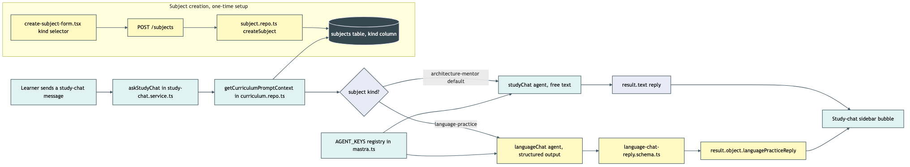

# Architecture Review: Subject pedagogy-kind + language-practice agent

## What was reviewed

The first of six sequenced wishlist items merging a standalone English-practice app into
post-anki as a new subject. In scope: a new `kind` column on `subjects`, a second Mastra agent
(`language-chat`) selected instead of the existing `study-chat` agent when a subject's kind is
`language-practice`, the create-subject UI control that sets it, and the e2e coverage proving the
two agents genuinely diverge. Built via `/grand-loop` + `/moonshine` (unattended), not the
standard `plan-ie`/`implement-ie`/`review-ie` flow — `review-ie` was deliberately skipped since it
is interactive and would stall an unattended run.

## Documentation found

`.bmad/english-subject-merge/architecture.md` already documents the intended shift and the
reversibility argument (all newly-added artifacts, no edits to existing agents) — read and
verified against the actual code rather than taken on faith. No `docs/architecture/` entry existed
for this feature before this review. The `.planning/LOG.md` entry timestamped 02:05 today serves
as the review-equivalent build record (real bugs found and fixed during the build, since no
separate `review.md` was produced by an interactive review step).

## As-built architecture

A learner's study-chat message reaches `askStudyChat` (`study-chat.service.ts`), which resolves
the subject's `kind` via `getCurriculumPromptContext` (`curriculum.repo.ts`) and picks one of two
agents registered in the same `AGENT_KEYS` map (`mastra.ts`): the pre-existing `studyChat` agent
(free-text reply) for the default `architecture-mentor` kind, or the new `languageChat` agent
(structured `{ languagePracticeReply }` output, schema defined in a sibling file, not on the
`Agent` constructor — matching how every other structured agent in this codebase passes its
schema at the `generate()` call site) for `language-practice`. Both paths render into the same
study-chat sidebar bubble, so the UI never needs to know which agent answered. The `kind` itself
is set once, at subject-creation time, through the existing create-subject form and persists as a
plain `not null default` column — every pre-existing subject silently keeps the old behavior.
Failure handling is unchanged: both branches share the same try/catch and the same
`FALLBACK_REPLY`, so a language-chat failure degrades exactly like a study-chat failure always has.

## Verdict

Sound. This is a genuinely additive change — no existing agent file, no existing `AGENT_KEYS`
entry, and no existing subject's behavior is touched, which was the explicit hard constraint going
in (the user's stated "I might change my mind" reversibility requirement). Two real tradeoffs worth
naming, neither of which crosses into critical territory:

1. **The `kind` enum now has to stay in sync across three independently-maintained schemas**: the
   Postgres column (`schema.ts`), the shared Zod schema (`packages/shared/src/subject.ts`), and a
   hand-duplicated frontend-local copy (`apps/web/src/curriculum/model.ts`) that the create-subject
   form's submit path actually validates against — not a re-export of the shared package. This
   duplication predates this feature (the consistency-gate pass that ran before the build caught it
   as an existing trap, not something newly introduced) but this feature is the first thing to
   actually rely on all three staying in lockstep for a value with real behavioral consequences.
   Adding a third pedagogy kind later means touching all three by hand, with no compiler check
   linking them.
2. **Agent selection is a single `if`/`else` today.** That's the right shape for two kinds, but the
   wishlist's own roadmap (items 2-6) plans a full English practice data model on top of this
   foundation, and further down the line a third pedagogy kind would turn this into a growing
   if/else chain rather than a lookup. Worth revisiting before (not necessarily at) that point —
   not a defect in what exists today, since today there are exactly two kinds and the branch is
   trivially readable.

Neither risks data loss or corruption, exposes a security boundary, risks an outage/cost runaway,
or creates a single point of failure — the bar for escalating further. No alternative architecture
is proposed.

## Questions a reviewer would ask

- What happens when a third pedagogy kind is added — does today's single `if`/`else` in
  `study-chat.service.ts` need to become a lookup/strategy map before wishlist item 2 lands, or is
  that a "when it happens" concern?
- Why does the `kind` enum live in three separate places (Postgres schema, shared package, and a
  hand-duplicated frontend copy) instead of the web app importing the type from
  `packages/shared` directly — is that duplication intentional isolation or accumulated debt?
- If a row somehow bypassed the column's `not null default` (a raw insert, a future migration that
  skips the default), does `askStudyChat` fail safely back to the `architecture-mentor` path, or
  could an unexpected `kind` value silently select neither agent?
- Is there a test exercising `languageChat`'s own failure path (an LLM error on that branch), or is
  coverage of the shared `FALLBACK_REPLY` behavior only implicit via the existing `study-chat`
  failure test?
- Is `languageChat`'s structured output (`languagePracticeReply`) purely a test-infrastructure
  necessity (distinguishing it from `study-chat`'s free text in the mock server's shape-based
  routing), or does it also reflect an intended product need for a machine-readable reply field
  later — worth knowing before a next agent copies the pattern for the wrong reason?
- Is a subject's `kind` meant to be permanent after creation (no edit/patch path exists), or is that
  simply out of scope for this first proof-of-mechanism slice?
- The home-page SSR fix (splitting the Electric live-query subtree into a client-only sibling
  component) changes when the board first shows live vs. loader-snapshot data — was the perceived
  "time to live data" on a real page load checked before/after, or only the e2e pass/fail signal?

## Debrief note — a pre-existing, unrelated regression was found and fixed during this build

Not part of this feature's design, but material to reviewing the diff: running the real e2e suite
(not just typecheck/vitest) surfaced that the home page's Electric-sync live query breaks SSR on
`/` for every visitor, unrelated to subject/kind — reproduced identically on the pre-existing,
unrelated `add-subject` test before any of this feature's code existed. Fixed at the root in
`apps/web/src/routes/index.tsx` by keeping the visible tree (`HomeView`) permanently mounted and
feeding it live data from a sibling component that only mounts client-side, instead of switching
between two different top-level components on the client-mount flip (an earlier attempt at this
fix did exactly that and introduced a new bug — remounting the whole tree, including
`CreateSubjectForm`'s local state — caught by re-running the full e2e suite, not just this
feature's own two scenarios). This fix is in scope for this review since it lives in the same
diff, but it is a repo-wide correctness fix, not part of the pedagogy-kind design itself.
