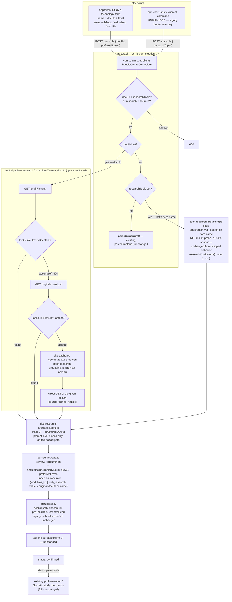

# Use-case study mode

Lets a learner point at a technology instead of pasting sources. The system
researches it — preferring a docs site's own published `llms.txt` map when
one exists — synthesizes a leveled knowledge map (basic/medium/advanced
modules), optionally pre-selecting the tier the learner asked for, and hands
off to the existing curate/confirm/study pipeline unchanged.

## Entry points

- **Web**: a "🔎 Study a technology" action next to "+ New curriculum" in
  `apps/web/src/subject/subject-section.tsx`, rendered by
  `apps/web/src/curriculum/study-technology-form.tsx`. Asks for a display
  **name**, a **documentation URL**, and a **level** (Basic/Medium/Advanced/
  no preference — defaults to Medium). Posts
  `{ subjectId, name, sources: [], docUrl, preferredLevel }` — no sources
  editor shown, and the legacy `researchTopic` field is never sent from the
  web form.
- **Bot**: a stateless `/study <name>` command, parsed in
  `apps/bot/src/conversation/reply.ts` exactly like the existing `/today`
  command, handled in `apps/bot/src/telegram/webhook.handler.ts` before any
  chat-mode checks. Still posts the legacy `{ name, researchTopic }` shape —
  no URL support, no level argument; this is a deliberate non-decision, not
  an oversight (see `docs/architecture/doc-link-technology-intake.md`). The
  bot only triggers research — reviewing the map and picking a slice happens
  on the web app, since the bot has no curate/confirm UI
  (`apps/bot/src/conversation/study-flow.ts`).

## Pipeline

`handleCreateCurriculum` (`apps/api/src/curriculum/curriculum.controller.ts`)
applies this precedence: `docUrl` and `researchTopic` can never both be set
(400); research (either trigger) and non-empty `sources` can never both be
set (400); a `docUrl` runs the doc-link research path; otherwise a legacy
`researchTopic` runs the bare-name research path and bypasses the subject's
`requireSources` mandate; otherwise non-empty `sources` runs the existing
pasted-material parse; otherwise the empty-sources fallthrough applies as it
does today.

Grounding for the doc-link path (`doc-link-grounding.ts`) tries, in order,
short-circuiting on the first success:

1. `GET <origin>/llms.txt` — a site's own curated map, when published.
2. `GET <origin>/llms-full.txt` — the same convention's full-content variant.
3. An anchored fallback: one site-restricted `openrouter:web_search` call
   plus a direct fetch of the given URL's own page, combined.

A soft-404 guard (`looksLikeLlmsTxtContent`) rejects a 200 response whose
body is actually the site's normal HTML shell, so a misconfigured "not
found" doesn't get treated as real grounding. The legacy bare-name path
(`tech-research-grounding.ts`) is unchanged — a single open-web
`openrouter:web_search` call, no llms.txt probe, no site anchor.

Synthesis (Pass 2, kept as its own OpenRouter call because the `web_search`
tool silently drops `json_schema` enforcement) is a Mastra agent
(`doc-research-architect.agent.ts`) with `structuredOutput` against
`docResearchPlanSchema` (`curriculum-research-plan.ts`), producing 2-7
modules each tagged `basic` / `medium` / `advanced`. When a level was
picked, the prompt is told which tier to give fuller treatment.

`researchCurriculum` (`curriculum-parse.orchestrator.ts`) runs both passes,
saves the plan via the same `saveCurriculumPlan` the pasted-material flow
uses (widened to accept an optional per-module `level`, a `defaultIncluded`
override, and a `preferredLevel` that pre-includes the matching tier's
topics), and inserts the grounding text as a `sources` row (`kind:
"web_research"` or `"llms_txt"`, `value` always the original `docUrl` for
every tier of that path) — this doubles as the audit trail and as the origin
signal for the "🔎 Researched" badge. `retryResearch` mirrors
`reparseCurriculum` (clear structure, re-run) but first reads back the prior
research `sources` row to tell a URL-driven curriculum apart from a
legacy name-driven one (`resolveRetryResearchSource`), so a retried
docs-URL curriculum re-runs the llms.txt-aware pipeline instead of silently
downgrading to the anchor-less bare-name search.

New topics from this flow default `included = false`, unless a level was
picked — in which case topics in the matching tier's module(s) start
`included = true` and every other tier stays excluded. Either way this turns
the existing ready-state curate/confirm screen into the "pick one slice"
moment with no new selection UI. `confirmCurriculum` still requires the
curriculum have something studyable — a topic-less module (already valid
today) or at least one included topic anywhere.

## What's explicitly unchanged

Everything downstream of "modules and topics exist": the probe-session and
Socratic study mechanics, the bot's nav/quiz/socratic modules, and the
pasted-material `curriculum-architect.agent.ts`'s own contract. The picked
level is not persisted — it only affects the prompt bias and the initial
`included` computation at insert time.

## Diagram

## Known limitation

"Add sources" / "Reparse" on a research-origin curriculum routes through the
existing pasted-material agent, which doesn't emit `level`. Any modules it
rebuilds lose their tier tag — the same way reparsing discards structure for
any curriculum today. Not fixed here.

Retrying a docs-URL-driven curriculum's failed research does not recover the
level originally picked at creation — an accepted limitation, same shape as
the reparse limitation above. See `docs/architecture/doc-link-technology-intake.md`
for the full doc-link/llms.txt/level design.
