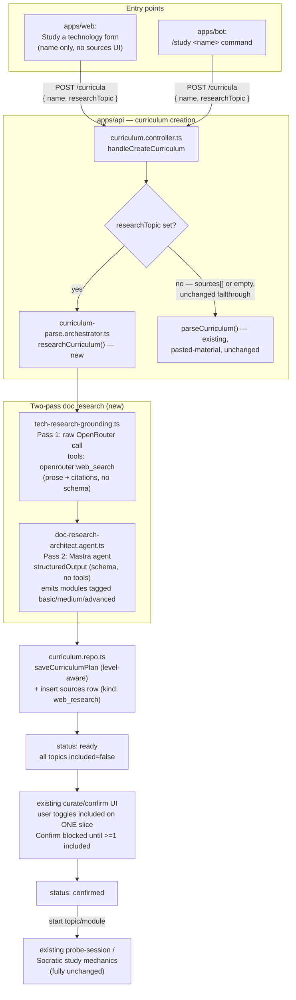
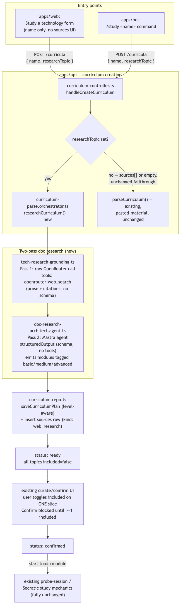

# Use-case study mode

Lets a learner name a technology instead of pasting sources. The system
researches it, synthesizes a leveled knowledge map (basic/medium/advanced
modules), and hands off to the existing curate/confirm/study pipeline
unchanged.

## Entry points

- **Web**: a "🔎 Study a technology" action next to "+ New curriculum" in
  `apps/web/src/subject/subject-section.tsx`. Posts
  `{ subjectId, name, researchTopic: name }` — no sources editor shown.
- **Bot**: a stateless `/study <name>` command, parsed in
  `apps/bot/src/conversation/reply.ts` exactly like the existing `/today`
  command, handled in `apps/bot/src/telegram/webhook.handler.ts` before any
  chat-mode checks. The bot only triggers research — reviewing the map and
  picking a slice happens on the web app, since the bot has no curate/confirm
  UI (`apps/bot/src/conversation/study-flow.ts`).

## Pipeline

`handleCreateCurriculum` (`apps/api/src/curriculum/curriculum.controller.ts`)
applies one precedence: a `researchTopic` runs doc research and bypasses the
subject's `requireSources` mandate; otherwise non-empty `sources` runs the
existing pasted-material parse; otherwise the empty-sources fallthrough
applies as it does today.

Doc research is two OpenRouter calls, kept separate because OpenRouter's
`web_search` tool silently drops `json_schema` enforcement:

1. **Pass 1 — grounding** (`tech-research-grounding.ts`): one raw
   `openrouter:web_search` call, mirroring the single-search shape already
   used by `apps/api/src/probe/probe-grounding.ts`. Produces prose + citations,
   no schema.
2. **Pass 2 — synthesis** (`doc-research-architect.agent.ts`): a Mastra agent
   with `structuredOutput` against `docResearchPlanSchema`
   (`curriculum-research-plan.ts`) — schema, no web tool. Combines the
   grounding with the model's own trained knowledge to produce 2-7 modules,
   each tagged `basic` / `medium` / `advanced`.

`researchCurriculum` (`curriculum-parse.orchestrator.ts`) runs both passes,
saves the plan via the same `saveCurriculumPlan` the pasted-material flow
uses (widened to accept an optional per-module `level` and a
`defaultIncluded` override), and inserts the grounding text as a `sources` row
(`kind: "web_research"`) — this doubles as the audit trail and as the origin
signal for the "🔎 Researched" badge. `retryResearch` mirrors
`reparseCurriculum`: clear structure, re-run.

New topics from this flow default `included = false`, turning the existing
ready-state curate/confirm screen into the "pick one slice" moment with no
new selection UI. `confirmCurriculum` now requires the curriculum have
something studyable — a topic-less module (already valid today) or at least
one included topic anywhere — not simply "≥1 included topic," which would
have regressed the pre-existing topic-less-module case.

## What's explicitly unchanged

Everything downstream of "modules and topics exist": the probe-session and
Socratic study mechanics, the bot's nav/quiz/socratic modules, and the
pasted-material `curriculum-architect.agent.ts`'s own contract.

## Diagram

## Known limitation

"Add sources" / "Reparse" on a research-origin curriculum routes through the
existing pasted-material agent, which doesn't emit `level`. Any modules it
rebuilds lose their tier tag — the same way reparsing discards structure for
any curriculum today. Not fixed here; see `.planning/use-case-study-mode/todo.md`.
