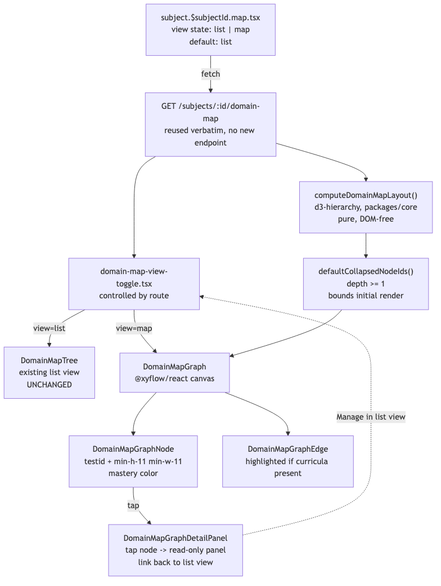

# Architecture Review: visual-knowledge-map

## What was reviewed

An additive graph/mind-map visualization of the domain-map taxonomy (issue #86) using
`@xyflow/react` for rendering/interaction and `d3-hierarchy` for layout math, toggled alongside the
existing text-tree list view. 9 new files, 2 modified, all uncommitted in the shared worktree
stacked on top of #84 and #85.

## Documentation found

`.planning/visual-knowledge-map/architecture.md` documents the library choice and rationale in
detail, written before build. Cross-checked against the actual code during this build's dual
review (Sonnet + Haiku, both independently re-verified all 7 red-team-flagged fixes and the test
suite) — no drift found.

## As-built architecture

The graph is a pure rendering layer over data the list view already fetches — no new endpoint, no
new stored state. `computeDomainMapLayout` (DOM-free, in `packages/core`) turns the API's flat node
list into a positioned tree via d3-hierarchy; `defaultCollapsedNodeIds` bounds the first paint to
depth-0/1 only. The view toggle is state owned by the route component (not the toggle itself),
which is what lets the detail panel's "manage in list view" link switch views from a nested
component without prop-drilling a callback three levels deep.

## Verdict

**Sound.** This was the most complex build in tonight's chain (new UI dependency, interactive
canvas rendering, touch support) and it earned the two-pass review it got — the dual review
independently confirmed all 7 pre-build red-team fixes, verified the `defaultCollapsedNodeIds`
depth-threshold correction by tracing the actual deriver contract (not just trusting the build
agent's stated reasoning), and confirmed React Flow's lifecycle is clean (single instance per
mount, genuine unmount on toggle via a real ternary, no manual subscriptions to leak).

One real tradeoff worth naming, surfaced by the Sonnet review: the jsdom `ResizeObserver` stub is a
no-op, so edge geometry never actually resolves in the test environment — SCENARIO 3's
highlighted-edge rendering has zero automated coverage beyond the underlying data flag being
deriver-tested. A typo'd `edgeTypes` key would silently fall back to React Flow's default edge with
nothing catching it. This matches what the plan's own Definition of Done asked for (unit assertions
plus a manual live check), so it isn't a violation of scope — just a real gap in the automated
safety net for one specific visual detail, worth knowing if this component gets touched again
without a human eyeballing the live canvas.

A second, unrelated but genuinely significant finding came out of this build's own verification
work, not the feature's design: the shared local dev Postgres has a structural migration-tracking
bug (drizzle's migrator comparing every migration against a single stale watermark) that
permanently and silently skips migration 0027, breaking the already-shipped duplicate-detection
feature locally. This is captured as its own wishlist item, not a defect in this ticket.

## Questions a reviewer would ask

1. Given the ResizeObserver-stub gap above, is there a lightweight way to assert `edgeTypes`
   wiring correctness without a real browser (e.g. asserting the rendered edge component's type
   prop directly) so a future typo would fail a fast test instead of only a manual check?
2. `collapsedNodeIds` is a `useState` lazy initializer keyed off `nodes` only at mount — if a loader
   revalidation ever changed the node set while Map view stayed open, newly-added depth≥1 nodes
   would render pre-expanded rather than collapsed. Nothing in this ticket's scope triggers that
   today — is it worth a one-line comment flagging the assumption for whoever adds live
   revalidation later?
3. The depth-bounded initial render explicitly does not scale to a "shallow-but-wide" taxonomy
   shape (documented, not a bug) — as the real seed taxonomy grows toward the full 208-node design,
   is there a plan to monitor whether any domain ends up wide enough at depth-0/1 to make first
   paint sluggish, or is this a "revisit if it becomes a real problem" situation?
4. React Flow is a young-ish major version (v12) with frequent releases — is there any pinning
   strategy beyond the default `npm install` resolution, given this is the first time this project
   has taken a dependency on an actively-fast-moving UI library rather than the more stable
   TanStack/Mastra stack it's built on elsewhere?
5. The detail panel is explicitly read-only with a link back to the list view for management — was
   a fully-interactive graph (accept/reject mapping suggestions directly on canvas) considered and
   deliberately deferred, or does the read-only choice reflect a harder technical constraint in
   React Flow's custom-node model?
