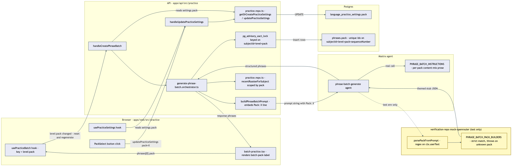

# Architecture Review: Workplace scenario packs (pack-themed phrase generation)

## What was reviewed

This item added no application code — it made the e2e mock LLM in `verification-repo` pack-aware
so that, for the first time, an automated test proves a selected pack actually reaches the model
and changes what gets generated and stored, not just what a UI button shows. Because the diff in
this repo is test infrastructure only, this review instead covers the mechanism that diff finally
proved works end to end: the pack-selection and pack-themed-generation path that landed earlier as
a side effect of the batch-practice and phrase-bank-mastery ports — `PackSelect`
(`apps/web/src/practice/pack-select.tsx`), `usePracticeBatch`
(`apps/web/src/practice/use-practice-batch.ts`), the settings/generation controller and repo
(`apps/api/src/practice/practice.controller.ts`, `practice.repo.ts`), the orchestrator
(`apps/api/src/practice/generate-phrase-batch.orchestrator.ts`), the agent prompt
(`apps/api/src/mastra/language-practice.agent.ts`), and the schema
(`apps/api/src/db/schema.ts`).

## Documentation found

`.planning/workplace-scenario-packs/spec.md` documents the mechanism in detail (it was written by
the planning agent that discovered the feature was already built) and matches the code exactly —
every claim in its "Headline finding" section was independently re-verified against the current
files rather than taken on trust. No `docs/architecture/` entry existed for this mechanism before
this review; this is the first one.

## As-built architecture

Entry point is a `PackSelect` button click, which calls `updatePracticeSettings` and writes
`language_practice_settings.pack` for that subject (primary-keyed by `subjectId`, so no
cross-subject contention). `usePracticeBatch` watches `level:pack` as a single composite key: any
change resets in-flight state, aborts stale requests via `AbortController`, and clears the
"already failed this key" guard, then re-fires `handleCreatePhraseBatch`. That controller re-reads
`settings.pack` from the DB (not from client-supplied input) and calls
`generatePhraseBatch(subjectId, level, pack)`, which builds a prompt embedding a literal
`Pack: <X>` line, scopes the "avoid repeating" query and the write-side Postgres advisory lock
(`pg_advisory_xact_lock(hashtext(subjectId || level || pack))`) to that exact tuple, and inserts
rows into `phrases` (unique-indexed on `subjectId, level, pack, sequenceNumber` as a DB-level
backstop for the same scope the lock protects). The UI's `batch-pack-label` reads
`phrases[0]?.pack` from the actually-rendered batch, not from the settings pointer, avoiding a
display race on pack switch.

The only thing this item added is the yellow subgraph: the test-only mock LLM now parses that same
`Pack: <X>` line out of the prompt and returns pack-themed stub content instead of one generic stub
for every pack, throwing on an unrecognized pack rather than silently returning the wrong theme.

## Verdict

**Sound.** The mechanism holds up on every axis that matters for this kind of feature:

- **Concurrency correctness is real, not just commented.** The advisory lock and the unique DB
  index are scoped to the same `subjectId+level+pack` tuple, so two concurrent generation calls
  for different packs on the same subject can't corrupt each other's sequence numbers, and the
  lock is a genuine backstop for the index rather than the only line of defense.
- **The frontend race-guarding is unusually thorough for this class of bug.** `usePracticeBatch`
  keys all state on `level:pack`, aborts stale in-flight requests on a key change, and separately
  tracks "last failed key" to stop a retry storm without permanently blocking a genuine retry after
  an actual pack switch — this was previously verified by `@english-batch-practice.S5` and isn't
  reopened here.
- **The one real tradeoff: pack theming is prompt-level, not schema-enforced.** Nothing stops the
  model from returning a phrase whose `domain` or content doesn't actually match the requested
  pack — `PHRASE_BATCH_INSTRUCTIONS` is prose the model is asked to follow, not a constraint the
  orchestrator validates on the way back. This is normal for LLM-generated content and not a
  defect; it just means "pack fidelity" is only as strong as the model's adherence to the prompt,
  which the mock's strict-match behavior cannot actually stand in for (the mock proves the pack
  parameter *reaches* the model correctly — it can't prove the real model *honors* it).
- **The mock's strict-throw-on-unknown-pack behavior is the right test-infrastructure choice** —
  it converts "silently wrong content" into a loud failure the moment a new pack is added to
  `packSchema` without a matching stub branch, which is exactly the property the spec says it was
  ported to preserve.

Nothing here crosses the bar for a critical/high-stakes finding (no data-loss, security, outage,
or single-point-of-failure risk), so no proposed alternative is warranted.

## Questions a reviewer would ask

1. Since pack fidelity is entirely prompt-driven, is there any production-side check (logging,
   spot audit, or a periodic eval) that a real model call actually stays on-theme for a given
   pack, or is the e2e mock's strict match the only place "pack correctness" is checked at all?
2. `recentRussianForSubject` and the advisory lock both scope by `pack`, but `handleCreateAttempts`
   grades using only `settings.level` — does grading ever need pack context, or is that
   intentionally pack-agnostic because the answer's correctness doesn't depend on which pack
   generated the question?
3. The unique index on `phrases(subjectId, level, pack, sequenceNumber)` is a backstop for the
   advisory lock — has anyone confirmed what happens on a unique-constraint violation inside the
   transaction (does the caller see a clean retryable error, or does it bubble up as a raw
   Postgres error to the API response)?
4. `usePracticeBatch`'s `lastFailedKeyRef` blocks retries for a failed `level:pack` key until the
   key changes — if a pack's generation fails because the *mock or model itself* is broken for
   that pack (not a transient error), does the user get any visible signal, or does the UI just
   sit stuck with no batch and no error shown?
5. `PACK_VALUES`/`PACK_LABELS`/`packSchema` currently list five packs — what's the process for
   adding a sixth (which files must change in lockstep: shared schema, agent instructions, DB
   default, e2e mock stub) and is there anything that would catch a partial rollout (e.g. UI has
   the button but the mock throws) before it reaches a real environment?
6. The DB-layer proof in `@workplace-scenario-packs.S2`/`.S3` uses `countWhere` against a live
   Postgres row count rather than asserting exact row content — is a future scenario expected to
   assert on the actual themed Russian/English text stored per pack, or is "count matches and UI
   text matches" considered sufficient proof for this feature going forward?
7. Now that three packs (`StandupUpdates`, `IncidentPostmortems`, `GivingFeedback`) have only
   "minimal but distinct" stub content with no scenario asserting on it, is there a tracked
   follow-up item for whoever picks one of those packs next, or does this rely on someone noticing
   the spec's "Out of scope" note manually?
